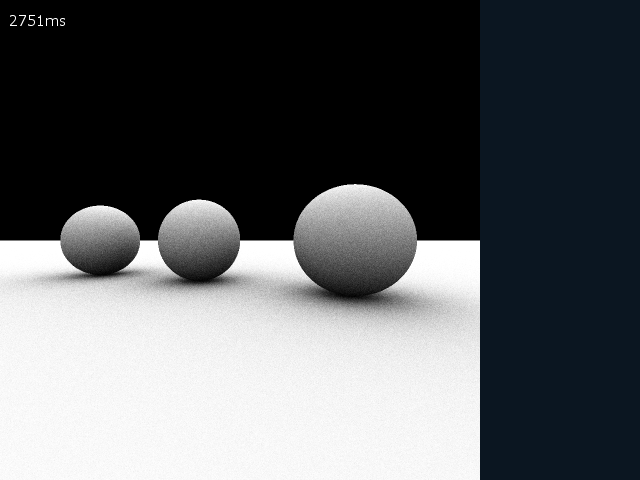

# aobench
  
ベンチマークプログラム <a href="http://code.google.com/p/aobench/" target="_blank">aobench</a> の Siv3D/C++ 実装
```cpp
# include <Siv3D.hpp>
const int32 WIDTH = 480;
const int32 HEIGHT = 480;
const int32 NSUBSAMPLES = 2;
const int32 NAO_SAMPLES = 8;

namespace ao
{
	struct Isect
	{
		double t;
		Vec3   p;
		Vec3   n;
		int32  hit;
	};

	struct Sphere
	{
		Vec3   center;
		double radius;
	};

	struct Plane
	{
		Vec3 p;
		Vec3 n;
	};

	struct Ray
	{
		Vec3 org;
		Vec3 dir;
	};

	Sphere spheres[3];

	Plane plane;

	void ray_sphere_intersect(Isect* isect, const Ray& ray, const Sphere& sphere)
	{
		const Vec3 rs = ray.org - sphere.center;
		const double B = rs.dot(ray.dir);
		const double C = rs.dot(rs) - sphere.radius * sphere.radius;
		const double D = B * B - C;

		if (D > 0.0)
		{
			const double t = -B - Sqrt(D);

			if ((t > 0.0) && (t < isect->t))
			{
				isect->t = t;
				isect->hit = 1;
				isect->p = ray.org + ray.dir * t;
				isect->n = (isect->p - sphere.center).normalized();
			}
		}
	}

	void ray_plane_intersect(Isect* isect, const Ray& ray, const Plane& _plane)
	{
		const double d = -_plane.p.dot(_plane.n);
		const double v = ray.dir.dot(_plane.n);

		if (Abs(v) < 1.0e-17)
		{
			return;
		}

		const double t = -(ray.org.dot(_plane.n) + d) / v;

		if ((t > 0.0) && (t < isect->t))
		{
			isect->t = t;
			isect->hit = 1;
			isect->p = ray.org + ray.dir * t;
			isect->n = _plane.n;
		}
	}

	std::array<Vec3, 3> orthoBasis(const Vec3& n)
	{
		std::array<Vec3, 3> basis;

		basis[2] = n;
		basis[1].set(0.0, 0.0, 0.0);

		if ((n.x < 0.6) && (n.x > -0.6))
		{
			basis[1].x = 1.0;
		}
		else if ((n.y < 0.6) && (n.y > -0.6))
		{
			basis[1].y = 1.0;
		}
		else if ((n.z < 0.6) && (n.z > -0.6))
		{
			basis[1].z = 1.0;
		}
		else
		{
			basis[1].x = 1.0;
		}

		basis[0] = basis[1].cross(basis[2]).normalized();
		basis[1] = basis[2].cross(basis[0]).normalized();

		return basis;
	}

	Vec3 ambient_occlusion(const Isect& isect)
	{
		const int32 ntheta = NAO_SAMPLES;
		const int32 nphi = NAO_SAMPLES;
		const double eps = 0.0001;
		const Vec3 p = isect.p + eps * isect.n;
		const std::array<Vec3, 3> basis = orthoBasis(isect.n);

		double occlusion = 0.0;

		for (int32 j = 0; j < ntheta; ++j)
		{
			for (int32 i = 0; i < nphi; ++i)
			{
				const double theta = Sqrt(Random());
				const double phi = TwoPi * Random();

				const double x = Cos(phi) * theta;
				const double y = Sin(phi) * theta;
				const double z = Sqrt(1.0 - theta * theta);

				const double rx = x * basis[0].x + y * basis[1].x + z * basis[2].x;
				const double ry = x * basis[0].y + y * basis[1].y + z * basis[2].y;
				const double rz = x * basis[0].z + y * basis[1].z + z * basis[2].z;

				const Ray ray = { p,{ rx, ry, rz } };

				Isect occIsect;
				occIsect.t = 1.0e+17;
				occIsect.hit = 0;

				ray_sphere_intersect(&occIsect, ray, spheres[0]);
				ray_sphere_intersect(&occIsect, ray, spheres[1]);
				ray_sphere_intersect(&occIsect, ray, spheres[2]);
				ray_plane_intersect(&occIsect, ray, plane);

				if (occIsect.hit)
				{
					occlusion += 1.0;
				}
			}
		}

		occlusion = (ntheta * nphi - occlusion) / (ntheta * nphi);

		return{ occlusion, occlusion, occlusion };
	}

	void render(Image& image, const int32 w, const int32 h, const int32 nsubsamples)
	{
		for (int32 y = 0; y < h; ++y)
		{
			for (int32 x = 0; x < w; ++x)
			{
				Vec3 color{ 0.0, 0.0, 0.0 };

				for (int32 v = 0; v < nsubsamples; ++v)
				{
					for (int32 u = 0; u < nsubsamples; ++u)
					{
						const double px = (x + (u / static_cast<double>(nsubsamples)) - (w / 2.0)) / (w / 2.0);
						const double py = -(y + (v / static_cast<double>(nsubsamples)) - (h / 2.0)) / (h / 2.0);

						const Ray ray = { { 0.0, 0.0, 0.0 }, Vec3{ px, py, -1.0 }.normalized() };

						Isect isect;
						isect.t = 1.0e+17;
						isect.hit = 0;

						ray_sphere_intersect(&isect, ray, spheres[0]);
						ray_sphere_intersect(&isect, ray, spheres[1]);
						ray_sphere_intersect(&isect, ray, spheres[2]);
						ray_plane_intersect(&isect, ray, plane);

						if (isect.hit)
						{
							color += ambient_occlusion(isect);
						}
					}
				}

				color /= nsubsamples * nsubsamples;

				image[y][x] = ColorF{ color.x, color.y, color.z };
			}
		}
	}

	void init_scene()
	{
		spheres[0].center.set(-2.0, 0.0, -3.5);
		spheres[0].radius = 0.5;

		spheres[1].center.set(-0.5, 0.0, -3.0);
		spheres[1].radius = 0.5;

		spheres[2].center.set(1.0, 0.0, -2.2);
		spheres[2].radius = 0.5;

		plane.p.set(0.0, -0.5, 0.0);
		plane.n.set(0.0, 1.0, 0.0);
	}
}

void Main()
{
	ao::init_scene();

	Image image(WIDTH, HEIGHT);

	Stopwatch stopwatch(true);

	ao::render(image, WIDTH, HEIGHT, NSUBSAMPLES);

	Println(stopwatch.ms(), L"ms");

	Texture(image).draw();

	WaitKey();
}
```
