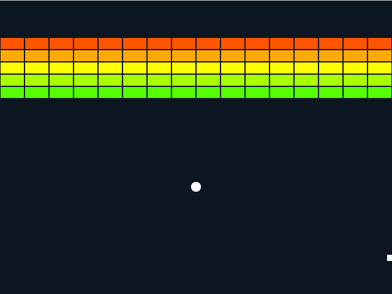

# ブロックくずし
  
ブロックや壁の大きさ、ボールのスピード、サウンドなどを変えてみましょう。
```cpp
# include <Siv3D.hpp>

void Main()
{
	const Sound sound(Wave(0.1s, [](double t) { return Fraction(t * 440)*0.5 - 0.25; }));
	const Point blockSize(40, 20);
	const double speed = 8.0;
	Rect wall(60, 10);
	Circle ball(320, 400, 8);
	Vec2 ballSpeed(0, -speed);

	Array<Rect> blocks;
	for (auto p : step({ Window::Width() / blockSize.x , 5 }))
	{
		blocks.emplace_back((p*blockSize).moveBy(0, 60), blockSize);
	}

	while (System::Update())
	{
		ball.moveBy(ballSpeed);
		wall.setCenter(Mouse::Pos().x, 420);

		for (auto it = blocks.begin(); it != blocks.end(); ++it)
		{
			if (it->intersects(ball))
			{
				(it->bottom.intersects(ball) || it->top.intersects(ball)
					? ballSpeed.y : ballSpeed.x) *= -1;

				blocks.erase(it);
				sound.playMulti();
				break;
			}
		}

		for (auto const& block : blocks)
		{
			block.stretched(-1).draw(HSV(block.y - 40));
		}

		if (ball.y < 0 && ballSpeed.y <  0)
		{
			ballSpeed.y *= -1;
		}

		if ((ball.x < 0 && ballSpeed.x < 0) || (Window::Width() < ball.x && ballSpeed.x > 0))
		{
			ballSpeed.x *= -1;
		}

		if (ballSpeed.y > 0 && wall.intersects(ball))
		{
			ballSpeed = Vec2((ball.x - wall.center.x) / 8, -ballSpeed.y).setLength(speed);
		}

		ball.draw();
		wall.draw();
	}
}
```
