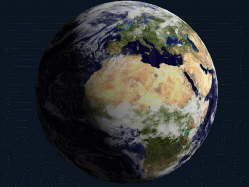
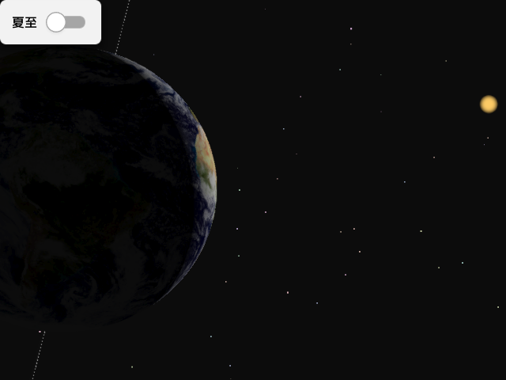

# 地球

## 地球
 
```cpp
# include <Siv3D.hpp>

void Main()
{
	const Texture texture(L"Example/Earth.jpg", TextureDesc::For3D);

	while (System::Update())
	{
		Graphics3D::FreeCamera();

		const double yaw = System::FrameCount() * -0.001;

		Sphere(10).asMesh()
			.rotated(Quaternion::Yaw(yaw).roll(-23.4_deg))
			.draw(texture);
	}
}
```

## 地球と太陽
 
```cpp
# include <Siv3D.hpp>

void Main()
{
	Graphics::SetBackground(Color(12));
	Graphics3D::SetLight(0, Light::Directional(Vec3(1, 0, 0)));
	Graphics3D::SetAmbientLight(ColorF(0.05));
	Graphics3D::SetBlendStateForward(BlendState::Additive);
	Graphics3D::SetDepthStateForward(DepthState::TestOnly);

	const Mesh meshSphere(MeshData::Sphere(10.0, 64));
	const Texture texture(L"Example/Earth.jpg", TextureDesc::For3D);
	const Texture textureStar(L"Example/Particle.png", TextureDesc::For3D);
	
	GUI gui(GUIStyle::Default);
	gui.add(L"solstice", GUIToggleSwitch::Create(L"夏至", L"冬至", false));

	Array<Particle> particles(2000);

	for (size_t i = 0; i < particles.size(); ++i)
	{
		const Vec3 pos = Spherical(10000, Random(Pi), Random(TwoPi));
		particles[i] = Particle(pos, Random(20, 60), RandomColorH(0.2, 1.0));
	}

	particles[particles.size() - 1] = Particle(Vec3(10000, 0, 0), 400.0, ColorF(1.0, 0.8, 0.4));

	while (System::Update())
	{
		Graphics3D::FreeCamera();

		const double yaw = System::FrameCount() * -0.001;

		const double angle = (gui.toggleSwitch(L"solstice").isLeft ? -23.4_deg : 23.4_deg);

		meshSphere
			.rotated(Quaternion::Yaw(yaw).roll(angle))
			.draw(texture);

		Cylinder(Vec3(0, -20, 0), Vec3(0, 20, 0), 0.1).asMesh()
			.rotated(Quaternion::Yaw(yaw).roll(angle))
			.draw();

		Graphics3D::DrawParticlesForward(particles, textureStar);
	}
}
```
