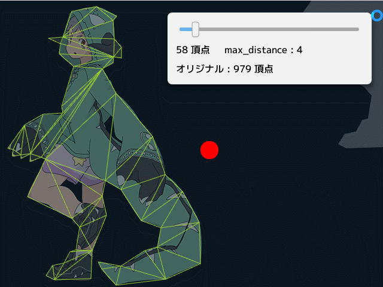

# Image to Polygon
 
```cpp
# include <Siv3D.hpp>

void Main()
{
	double max_distance = 4.0;

	GUI gui(GUIStyle::Default);
	gui.addln(L"max_distance", GUISlider::Create(0.5, 40.0, max_distance, 300));
	gui.addln(L"vertices", GUIText::Create(L""));
	gui.addln(L"original", GUIText::Create(L""));
	gui.setPos(280, 20);

	const Image image(L"Example/siv3d-kun.png");

	// アルファ値を使うか、白黒を使うか
	const bool useAlpha = true;

	const Polygon polygon = Imaging::FindExternalContour(image, useAlpha);

	Polygon simplifiedPolygon = polygon.simplified(gui.slider(L"max_distance").value);

	const Texture texture(image);

	const Circle circle(350, 250, 15);

	while (System::Update())
	{
		if (gui.slider(L"max_distance").hasChanged)
		{
			max_distance = gui.slider(L"max_distance").value;

			simplifiedPolygon = polygon.simplified(max_distance);
		}

		texture.draw(Alpha(120));

		gui.text(L"vertices").text = Format(simplifiedPolygon.num_vertices, L" 頂点\tmax_distance : ", max_distance);

		gui.text(L"original").text = Format(L"オリジナル : ", polygon.num_vertices, L" 頂点");

		simplifiedPolygon.drawWireframe(1.0, Palette::Yellowgreen);

		const Polygon movedPolygon = simplifiedPolygon.movedBy(Mouse::Pos() - simplifiedPolygon.boundingRect.center);

		const Color color = Alpha(movedPolygon.intersects(circle) ? 150 : 50);

		circle.draw(Palette::Red);

		movedPolygon.draw(color);
	}
}
```
