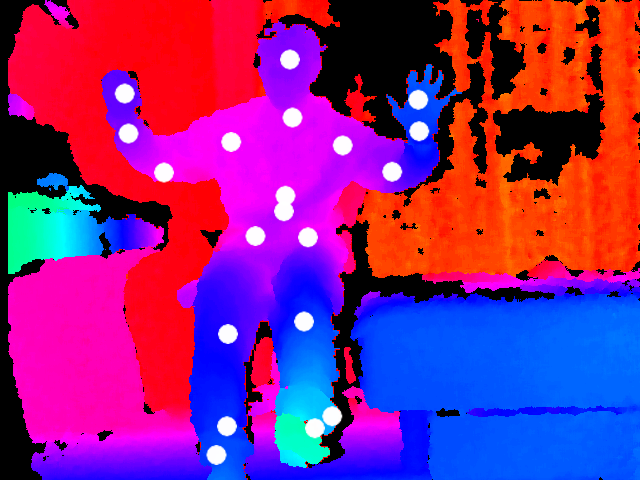

# Kinect v1

## デプスとボディを取得する
  
```cpp
# include <Siv3D.hpp>

void Main()
{
	if (!KinectV1::IsAvailable())
	{
		MessageBox::Show(L"Kinect は利用できません。");
		return;
	}

	if (!KinectV1::Start())
	{
		MessageBox::Show(L"Kinect の起動に失敗しました。");
		return;
	}

	DynamicTexture depthTexture;

	std::array<Optional<KinectV1Body>, 2> bodies;

	while (System::Update())
	{
		if (KinectV1::HasNewDepthFrame())
		{
			KinectV1::GetDepthFrame(depthTexture);
		}

		if (KinectV1::HasNewBodyFrame())
		{
			KinectV1::GetBodyFrame(bodies);
		}

		depthTexture.draw();

		for (const auto& body : bodies)
		{
			if (!body)
			{
				// 認識したボディが無い
				continue;
			}

			for (const auto& joint : body->joints)
			{
				Circle(joint.depthSpacePos, 10).draw();
			}
		}
	}
}
```

## RGB 画像を取得する
`KinectV1::Start()` の引数で、取得する情報をカスタマイズできます。  
ボディの取得にはデプスが必要です。
```cpp
# include <Siv3D.hpp>

void Main()
{
	if (!KinectV1::IsAvailable())
	{
		MessageBox::Show(L"Kinect は利用できません。");
		return;
	}

	// デプス (640x480) と RGB (640x480)
	if (!KinectV1::Start(KinectV1DataType::Depth_640x480 | KinectV1DataType::Color_640x480))
	{
		MessageBox::Show(L"Kinect の起動に失敗しました。");
		return;
	}

	DynamicTexture depthTexture, colorTexture;

	while (System::Update())
	{
		if (KinectV1::HasNewDepthFrame())
		{
			KinectV1::GetDepthFrame(depthTexture);
		}

		if (KinectV1::HasNewColorFrame())
		{
			KinectV1::GetColorFrame(colorTexture);
		}

		depthTexture.draw();

		colorTexture.draw(Alpha(127));
	}
}
```
