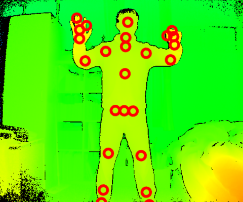

# Kinect v2

## デプスとボディを取得する
 
```cpp
# include <Siv3D.hpp>

void Main()
{
	if (!KinectV2::IsAvailable())
	{
		return;
	}

	if (!KinectV2::Start())
	{
		return;
	}

	DynamicTexture depthTexture;

	std::array<Optional<KinectV2Body>, 6> bodies;

	while (System::Update())
	{
		if (KinectV2::HasNewDepthFrame())
		{
			KinectV2::GetDepthFrame(depthTexture);
		}

		if (KinectV2::HasNewBodyFrame())
		{
			KinectV2::GetBodyFrame(bodies);
		}

		depthTexture.draw();

		for (const auto& body : bodies)
		{
			if (!body)
			{
				continue;
			}

			for (const auto& joint : body->joints)
			{
				Circle(joint.depthSpacePos, 15).drawFrame(6.0, 0.0, Palette::Red);
			}
		}
	}
}
```

## 全ての情報を取得する
```cpp
# include <Siv3D.hpp>

String ToString(HandState handState)
{
	switch (handState)
	{
	case HandState::NotTracked:
		return L"Not Tracked";
	case HandState::Open:
		return L"Open";
	case HandState::Closed:
		return L"Closed";
	case HandState::Lasso:
		return L"Lasso";
	default:
		return L"Unknown";
	}
}

Color CustomDepthColoring(uint16 depth)
{
	return depth != 0 ? HSV(depth / 4.0, 1.0, 0.8) : Palette::Black;
}

void Main()
{
	Window::Resize(1280, 860);

	if (!KinectV2::IsAvailable())
	{
		MessageBox::Show(L"Kinect v2 は利用できません");

		return;
	}

	const int dataTypeFlag =
		KinectV2DataType::Default		// RGB 画像, 深度画像, BodyIndex 画像, Body(関節)
		| KinectV2DataType::Infrared	// 赤外線画像
		| KinectV2DataType::AudioBeam;	// 音源方向

	if (!KinectV2::Start(dataTypeFlag))
	{
		MessageBox::Show(L"Kinect v2 の起動に失敗しました。");

		return;
	}

	DynamicTexture colorTexture, depthTexture, bodyIndexTexture, infraredTexture;

	std::array<Optional<KinectV2Body>, 6> bodies;

	KinectV2AudioBeam audioBeam;

	const Font font(30, Typeface::Heavy), font2(20);

	const double rgbScaling = 424.0 / 1080.0;

	while (System::Update())
	{
		if (KinectV2::HasNewColorFrame())
		{
			KinectV2::GetColorFrame(colorTexture);
		}

		if (KinectV2::HasNewDepthFrame())
		{
			KinectV2::GetDepthFrame(depthTexture, CustomDepthColoring);
		}

		if (KinectV2::HasNewBodyIndexFrame())
		{
			KinectV2::GetBodyIndexFrame(bodyIndexTexture);
		}

		if (KinectV2::HasNewBodyFrame())
		{
			KinectV2::GetBodyFrame(bodies);
		}

		if (KinectV2::HasNewInfraredFrame())
		{
			KinectV2::GetInfraredFrame(infraredTexture);
		}

		if (KinectV2::HasNewAudioBeamFrame())
		{
			KinectV2::GetAudioBeamFrame(audioBeam);
		}

		depthTexture.draw(0, 0);

		colorTexture.scale(rgbScaling).draw(512, 0);

		bodyIndexTexture.draw(0, 424);

		infraredTexture.draw(512, 424);

		for (uint32 i = 0; i < bodies.size(); ++i)
		{
			const auto& body = bodies[i];

			if (!body)
			{
				continue;
			}

			for (const auto& joint : body->joints)
			{
				Circle(joint.depthSpacePos, 15).drawFrame(6.0, 0.0, HSV(i * 60));

				Circle(joint.colorSpacePos * rgbScaling + Point(512, 0), 10).drawFrame(6.0, 0.0, HSV(i * 60));
			}

			font(ToString(body->leftHand)).drawCenter(body->joints[V2JointType::HandLeft].depthSpacePos);

			font(ToString(body->rightHand)).drawCenter(body->joints[V2JointType::HandRight].depthSpacePos);

			font(L"傾き:", 2_dp, body->lean).drawCenter(body->joints[V2JointType::Head].depthSpacePos + Point(0, -40));
		}

		font2(L"音源方向: ", 1_dp, Degrees(audioBeam.angle), L"°").draw(1040, 460);

		const Vec2 center(1152, 520);

		Circle(center, 160).drawArc(Radians(90 + 40), Radians(100), 100, 0, Color(120));

		Line(center, (center + Vec2(0, 160).rotate(-audioBeam.angle))).drawArrow(6, { 20, 20 });

		Window::SetTitle(Profiler::FPS(), L"fps");
	}
}
```