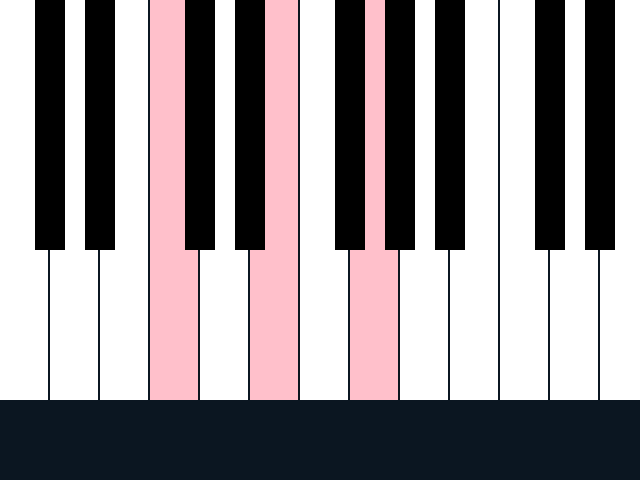

# ピアノ
 
```cpp
# include <Siv3D.hpp>

double Synth(double t, double f)
{
	const double a = Sin(t * 523 * f * TwoPi);
	const double b = Sin(t * 523 * f * TwoPi * 2.0)*0.3;
	const double c = Sin(t * 523 * f * TwoPi * 3.0)*0.8;
	const double d = (Fraction(t * 523 * f)*2.0 - 1.0)*0.2;
	return (a + b + c + d) / 4.0*(1.0 - t);
}

void Main()
{
	const int32 numOfKeys = 22;
	std::array<Sound, numOfKeys> sounds;

	for (auto i : step(numOfKeys))
	{
		auto function = std::bind(Synth, std::placeholders::_1, Exp2((i - 5) / 12.0));
		sounds[i] = Sound(Wave(1.0s, function));
	}

	const std::array<Key, numOfKeys> keys =
	{
		Input::KeyQ, Input::Key2, Input::KeyW, Input::Key3, Input::KeyE, Input::KeyR,
		Input::Key5, Input::KeyT, Input::Key6, Input::KeyY, Input::KeyU, Input::Key8,
		Input::KeyI, Input::Key9, Input::KeyO, Input::Key0, Input::KeyP, Input::KeyAt,
		Input::KeyCaret, Input::KeyLBracket, Input::KeyYen, Input::KeyEnter
	};

	const std::array<int32, numOfKeys> keyOffset =
	{
		0, 1, 2, 3, 4, 6, 7, 8, 9, 10, 12, 13, 14, 15, 16, 17, 18, 20, 21, 22, 23, 24
	};

	while (System::Update())
	{
		for (auto i : step(numOfKeys))
		{
			if (keys[i].clicked)
			{
				sounds[i].playMulti(0.3);
			}
		}

		for (auto i : step(numOfKeys))
		{
			if (keyOffset[i] % 2 == 0)
			{
				Rect(keyOffset[i] / 2 * 50, 0, 48, 400).draw(keys[i].pressed ? Palette::Pink : Palette::White);
			}
		}

		for (auto i : step(numOfKeys))
		{
			if (keyOffset[i] % 2 == 1)
			{
				Rect(35 + keyOffset[i] / 2 * 50, 0, 30, 250).draw(keys[i].pressed ? Palette::Pink : Palette::Black);
			}
		}
	}
}
```
