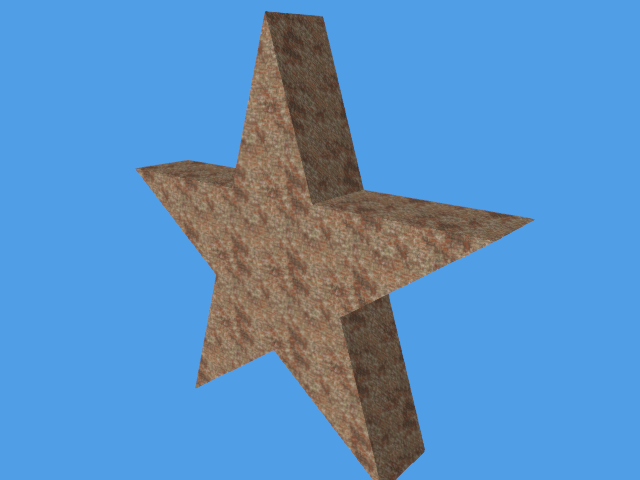

# Polygon to Mesh

## 基本
 
```cpp
# include <Siv3D.hpp>

void Main()
{
	Graphics::SetBackground(Color(80, 160, 230));

	Graphics3D::SetAmbientLight(ColorF(0.4));

	const Polygon polygon = Geometry2D::CreateStar(3.0);

	const Mesh mesh(MeshData::Polygon(polygon, 1.0, { 1, 1 }, { 0, 0 }));

	const Texture texture(L"Example/brick.jpg", TextureDesc::For3D);

	while (System::Update())
	{
		Graphics3D::FreeCamera();

		const auto mat = Quaternion::Pitch(-HalfPi).toMatrix();

		mesh.draw(mat, texture);
	}
}
```

## Image to Mesh
  
白黒画像の白い部分を使って Polygon を作成し、その Polygon から MeshData を作成します。  
白黒画像に幅が 1 px の細い点や線が含まれている場合、エラーになります。
```cpp
# include <Siv3D.hpp>

void Main()
{
	Window::Resize(800, 600);
	Graphics::SetBackground(Color(80, 160, 230));
	Graphics3D::SetAmbientLight(ColorF(0.4));

	double depth = 1.0;
	double uvScale = 1.0;
	Vec2 uvOffset(0, 0);

	// 厚み部分へのマッピングパターン（どの向きもきれいに見える貼り方はできない）
	Vec2 uvY(1, 1);

	Texture texture(L"Example/brick.jpg", TextureDesc::For3D);
	Polygon polygon = Geometry2D::CreateStar(300.0, 0.0, { 300, 300 });
	Mesh mesh;

	GUI gui(GUIStyle::Default);
	gui.addln(L"depth", GUIText::Create(L""));
	gui.addln(L"depth", GUISlider::Create(0.0, 8.0, depth, 160));
	gui.addln(L"uvScale", GUIText::Create(L""));
	gui.addln(L"uvScale", GUISlider::Create(0.0, 4.0, uvScale, 160));
	gui.addln(L"uvOffset.x", GUIText::Create(L""));
	gui.addln(L"uvOffset.x", GUISlider::Create(-4.0, 4.0, uvOffset.x, 160));
	gui.addln(L"uvOffset.y", GUIText::Create(L""));
	gui.addln(L"uvOffset.y", GUISlider::Create(-4.0, 4.0, uvOffset.y, 160));
	gui.addln(L"uvY.x", GUIText::Create(L""));
	gui.addln(L"uvY.x", GUISlider::Create(0.0, 1.0, uvY.x, 160));
	gui.addln(L"uvY.y", GUIText::Create(L""));
	gui.addln(L"uvY.y", GUISlider::Create(0.0, 1.0, uvY.y, 160));
	gui.addln(L"update", GUIButton::Create(L"パラメータを更新"));
	gui.addln(L"loadPolygon", GUIButton::Create(L"白黒画像から Mesh を作成"));
	gui.addln(L"loadTexture", GUIButton::Create(L"Texture を変更"));

	bool update = true;

	while (System::Update())
	{
		Graphics3D::FreeCamera();

		if (gui.button(L"loadPolygon").pushed)
		{
			polygon = Imaging::FindContour(Dialog::OpenImage()).simplified(1);
			update = true;
		}

		if (gui.button(L"loadTexture").pushed)
		{
			texture = Dialog::OpenTexture(TextureDesc::For3D);
		}

		gui.text(L"depth").text = Format(L"depth: ", gui.slider(L"depth").value);
		gui.text(L"uvScale").text = Format(L"uvScale: ", gui.slider(L"uvScale").value);
		gui.text(L"uvOffset.x").text = Format(L"uvOffset.x: ", gui.slider(L"uvOffset.x").value);
		gui.text(L"uvOffset.y").text = Format(L"uvOffset.y: ", gui.slider(L"uvOffset.y").value);
		gui.text(L"uvY.x").text = Format(L"uvY.x: ", gui.slider(L"uvY.x").value);
		gui.text(L"uvY.y").text = Format(L"uvY.y: ", gui.slider(L"uvY.y").value);

		update |= gui.button(L"update").pushed;

		if (polygon && update)
		{
			depth = gui.slider(L"depth").value;
			uvScale = gui.slider(L"uvScale").value;
			uvOffset.x = gui.slider(L"uvOffset.x").value;
			uvOffset.y = gui.slider(L"uvOffset.y").value;
			uvY.x = gui.slider(L"uvY.x").value;
			uvY.y = gui.slider(L"uvY.y").value;

			mesh = Mesh(MeshData::Polygon(polygon.scaled(0.01), depth, Vec2(uvScale, uvScale), uvOffset, uvY));
			update = false;
		}

		const auto mat = Quaternion::Pitch(-HalfPi).toMatrix();

		mesh.draw(mat, texture);
	}
}
```
