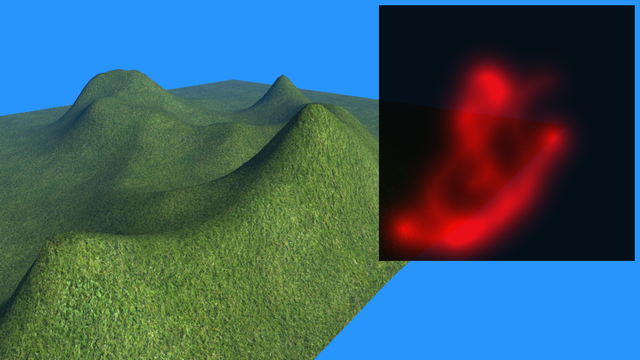

# 地形
 
```cpp
# include <Siv3D.hpp>

void Main()
{
	Window::Resize(1280, 720);
	Graphics::SetBackground(Color(40, 150, 255));
	Graphics3D::SetAmbientLight(ColorF(0.2, 0.3, 0.4));
	Graphics3D::SetFog(Fog::SquaredExponential(Color(40, 150, 255), 0.002));

	const VertexShader vsTerrain(L"Example/Shaders/Terrain3D.hlsl");
	const PixelShader psTerrain(L"Example/Shaders/Terrain3D.hlsl");
	if (!vsTerrain || !psTerrain)
	{
		return;
	}

	const Texture textureGround(L"Example/grass.jpg", TextureDesc::For3D);
	const Mesh terrainBase(MeshData::TerrainBase(160));
	RenderTexture heightMap{ 512, 512, ColorF(0), TextureFormat::R32_Float };

	const Texture texture(Image(64, 64, [](Point p)
	{
		return ColorF(Pow(1 - Vec2(p).distanceFrom(Vec2(32, 32)) / (32 * 1.4142), 4));
	}));

	while (System::Update())
	{
		Graphics3D::FreeCamera();

		if ((Input::MouseL | Input::MouseR).pressed)
		{
			Graphics2D::SetRenderTarget(heightMap);
			Graphics2D::SetBlendState(Input::MouseL.pressed ? BlendState::Additive : BlendState::Subtractive);

			texture.scale(2.5).drawAt(Mouse::Pos() - Point(1280 - 512 - 10, 10), ColorF(0.2));

			Graphics2D::SetBlendState(BlendState::Default);
			Graphics2D::SetRenderTarget(Graphics::GetSwapChainTexture());
		}

		Graphics3D::BeginVS(vsTerrain);
		Graphics3D::BeginPS(psTerrain);
		Graphics3D::SetTexture(ShaderStage::Vertex, 0, heightMap);
		Graphics3D::SetSamplerState(ShaderStage::Vertex, 0, SamplerState::ClampLinear);

		terrainBase.draw(textureGround);

		Graphics3D::SetTexture(ShaderStage::Vertex, 0, none);
		Graphics3D::EndPS();
		Graphics3D::EndVS();

		heightMap.draw(1280 - 512 - 10, 10, ColorF(0.3, 0.9));
	}
}
```
