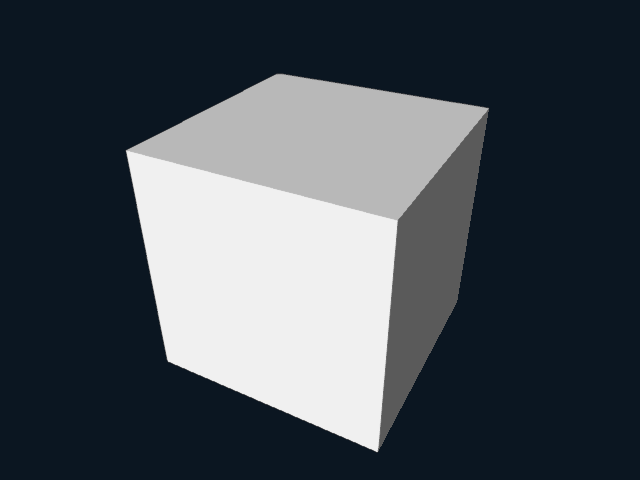
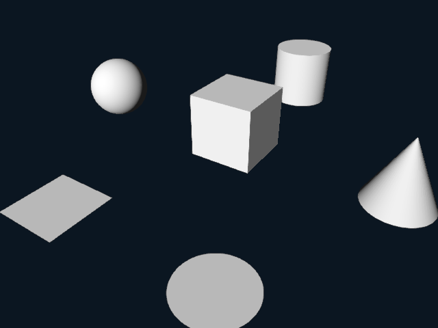
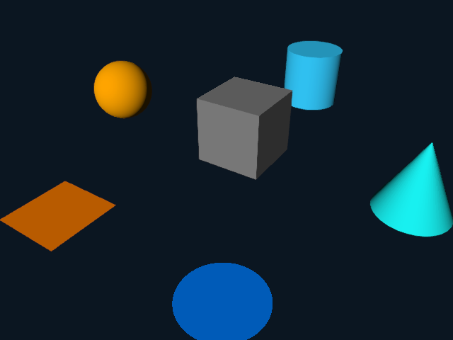
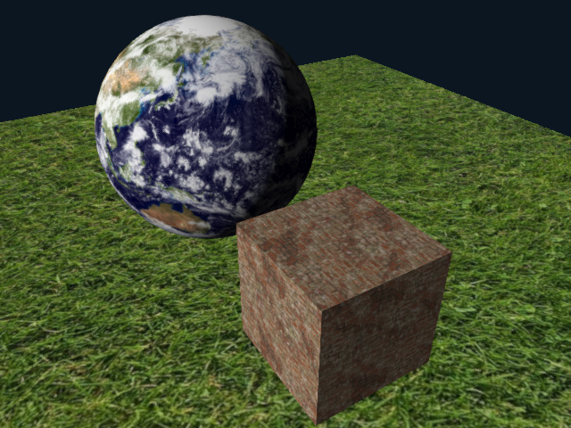
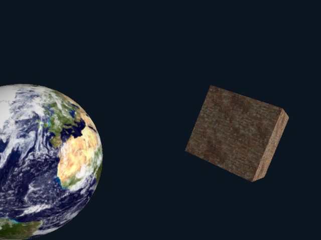
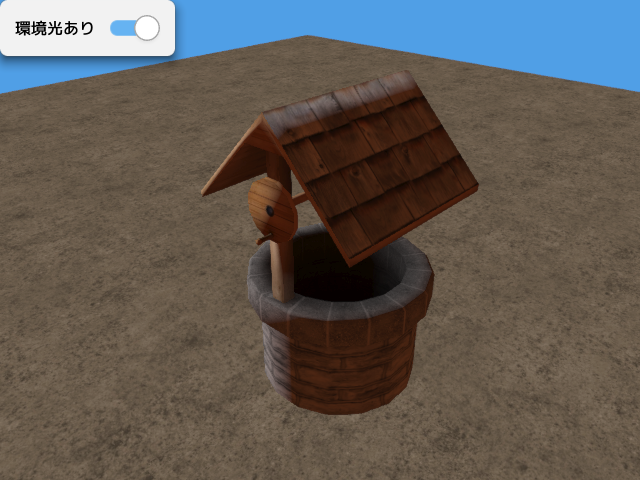
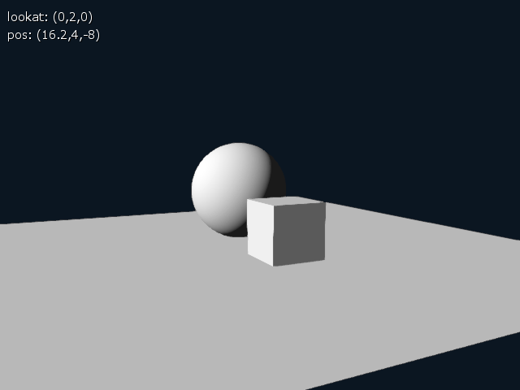
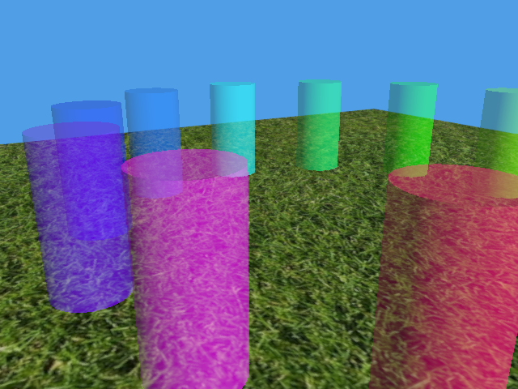

# 27. 3D 描画

## ボックスを描く
  
```cpp
# include <Siv3D.hpp>

void Main()
{
	while (System::Update())
	{
		Box(4).draw();
	}
}
```

## 3D 空間を自由に移動する
  
`Graphics3D::FreeCamera()` を毎フレーム呼ぶと、W, A, S, D, E, X, アローキーを使って 3D 空間を移動できるようになります。
```cpp
# include <Siv3D.hpp>

void Main()
{
	while (System::Update())
	{
		Graphics3D::FreeCamera();

		Box(4).draw();
	}
}
```

## いろいろな 3D 形状を描く
  
```cpp
# include <Siv3D.hpp>

void Main()
{
	while (System::Update())
	{
		Graphics3D::FreeCamera();

		Plane(Vec3(-5, 0, -10), 4).draw();

		Disc(Vec3(5, 0, -10), 2).draw();

		Sphere(Vec3(-10, 2, 0), 2).draw();

		Box(Vec3(0, 2, 0), 4).draw();

		Cone(Vec3(10, 0, 0), 2, 4).draw();

		Cylinder(Vec3(0, 2, 10), 2, 4).draw();
	}
}
```

## 3D 形状に色を付ける
  
`Color` や `HSV` に加え、RGBA の各成分を 0.0～1.0 で表す `ColorF` 型が使えます。
```cpp
# include <Siv3D.hpp>

void Main()
{
	while (System::Update())
	{
		Graphics3D::FreeCamera();

		Plane(Vec3(-5, 0, -10), 4).draw(ColorF(1.0, 0.5, 0.0));

		Disc(Vec3(5, 0, -10), 2).draw(ColorF(0.0, 0.5, 1.0));

		Sphere(Vec3(-10, 2, 0), 2).draw(Palette::Orange);

		Box(Vec3(0, 2, 0), 4).draw(Color(127, 127, 127));

		Cone(Vec3(10, 0, 0), 2, 4).draw(HSV(180, 0.9, 1.0));

		Cylinder(Vec3(0, 2, 10), 2, 4).draw(ColorF(0.2, 0.8, 1.0));
	}
}
```

## 3D 形状にテクスチャを貼る
  
3D 描画に用いる `Texture` を作成する際は、`TextureDesc::For3D` を指定します。  
この指定により、エンジン内部で sRGB フォーマットの設定とミップマップが作成され、3D 描画に適した Texture が作成されます。
```cpp
# include <Siv3D.hpp>

void Main()
{
	const Texture textureGrass(L"Example/Grass.jpg", TextureDesc::For3D);
	const Texture textureEarth(L"Example/Earth.jpg", TextureDesc::For3D);
	const Texture textureBrick(L"Example/Brick.jpg", TextureDesc::For3D);

	while (System::Update())
	{
		Graphics3D::FreeCamera();

		Plane(Vec3(0, 0, 0), 20).draw(textureGrass);

		Sphere(Vec3(-2, 2, 0), 2).draw(textureEarth);

		Box(Vec3(2, 1, 0), 2).draw(textureBrick);
	}
}
```

## 座標変換をする
  
`asMesh()` を使うと 3D 形状を `Mesh` として扱えます。  
`Mesh` は `translated()` や `rotated()`, `scaled()` で移動や回転、拡大縮小などの座標変換が柔軟にできます。
```cpp
# include <Siv3D.hpp>

void Main()
{
	const Texture textureEarth(L"Example/Earth.jpg", TextureDesc::For3D);
	const Texture textureBrick(L"Example/Brick.jpg", TextureDesc::For3D);

	Stopwatch stopwatch(true);

	while (System::Update())
	{
		const double t = stopwatch.ms() / 1000.0;

		Graphics3D::FreeCamera();

		Box(5).asMesh()
			.rotated(Quaternion::Roll(t))
			.draw(textureBrick);

		Sphere(5).asMesh()
			.rotated(Quaternion::Yaw(-t))
			.translated(15, 0, 0)
			.rotated(Quaternion::Yaw(t * -0.2))
			.draw(textureEarth);	
	}
}
```

## 3D 形状を作る
  
`MeshData` を使うと、独自に用意した頂点とインデックスデータから `Mesh` を作成できます。  
また、`MeshData` にはいくつかの基本形状を作る関数が用意されています。  
以下のプログラムは、その関数を使用して基本形状を作るサンプルです。
```cpp
# include <Siv3D.hpp>

void Main()
{
	Graphics::SetBackground(Color(80, 160, 230));

	const Texture textureEarth(L"Example/Earth.jpg", TextureDesc::For3D);

	const Mesh meshSphere5(MeshData::Sphere(2.0, 5));

	const Mesh meshFloor(MeshData::Plane(20, { 5, 5 }));

	const Mesh meshBipyramid(MeshData::Bipyramid(1.0, 2.0));

	while (System::Update())
	{
		Graphics3D::FreeCamera();

		meshFloor.draw(textureEarth);

		meshSphere5.translated(-3, 2, 0).draw();

		meshBipyramid.translated(3, 3, 0).draw(Palette::Yellowgreen);
	}
}
```

## 3D モデルデータを読み込む
  
現在のバージョンで対応している 3D モデルファイルの形式は Wavefront OBJ (.obj) のみです。  
OBJ 以外の形式のローダーを独自に実装する場合は、`MeshData` を使って `Mesh` の集合を作成してください。
```cpp
# include <Siv3D.hpp>

void Main()
{
	Graphics::SetBackground(Color(80, 160, 230));

	const Model model(L"Example/Well/Well.wavefrontobj");

	for (const auto& node : model.nodes())
	{
		if (!node.material.diffuseTextureName.isEmpty
			&& !TextureAsset::IsRegistered(node.material.diffuseTextureName))
		{
			TextureAsset::Register(node.material.diffuseTextureName,
				node.material.diffuseTextureName, TextureDesc::For3D);
		}
	}

	const Texture textureGround(L"Example/ground.jpg", TextureDesc::For3D);
	const Mesh meshGround(MeshData::Plane(30, 30, { 6, 6 }));

	while (System::Update())
	{
		Graphics3D::FreeCamera();

		meshGround.draw(textureGround);

		for (const auto& node : model.nodes())
		{
			if (node.material.diffuseTextureName.isEmpty)
			{
				node.mesh.draw();
			}
			else
			{
				node.mesh.draw(TextureAsset(node.material.diffuseTextureName));
			}
		}
	}
}
```

## 環境光を設定する
  
デフォルトの環境光は `ColorF(0.1, 0.1, 0.1)` に設定されています。
```cpp
# include <Siv3D.hpp>

void Main()
{
	GUI gui(GUIStyle::Default);
	gui.add(L"ambient", GUIToggleSwitch::Create(L"環境光なし", L"環境光あり", false));

	Graphics::SetBackground(Color(80, 160, 230));

	const Model model(L"Example/Well/Well.wavefrontobj");

	for (const auto& node : model.nodes())
	{
		if (!node.material.diffuseTextureName.isEmpty
			&& !TextureAsset::IsRegistered(node.material.diffuseTextureName))
		{
			TextureAsset::Register(node.material.diffuseTextureName,
				node.material.diffuseTextureName, TextureDesc::For3D);
		}
	}

	const Texture textureGround(L"Example/ground.jpg", TextureDesc::For3D);
	const Mesh meshGround(MeshData::Plane(30, 30, { 6, 6 }));

	while (System::Update())
	{
		Graphics3D::FreeCamera();

		meshGround.draw(textureGround);

		for (const auto& node : model.nodes())
		{
			if (node.material.diffuseTextureName.isEmpty)
			{
				node.mesh.draw();
			}
			else
			{
				node.mesh.draw(TextureAsset(node.material.diffuseTextureName));
			}
		}

		if (gui.toggleSwitch(L"ambient").isRight)
		{
			Graphics3D::SetAmbientLight(ColorF(0.4, 0.2, 0.1));
		}
		else
		{
			Graphics3D::SetAmbientLight(ColorF(0.0, 0.0, 0.0));
		}
	}
}
```

## ライティングを設定する
  
光源の種類は `Light::None()` (なし), `Light::Directional()` (平行光源), `Light::Point()` (点光源) の 3 種類です。  
デフォルトでは インデックス 0 に `Light::Directional({ 0.1, 0.5, -0.9 }, { 1.0, 1.0, 1.0 })` が設定されています。  
光源の上限数は `Graphics3D::MaxLight` で定義されている 128 個です。後述する Forward Rendering の光源の上限数は `Graphics3D::MaxLightForward` で定義されている 4 個です。
```cpp
# include <Siv3D.hpp>

void Main()
{
	GUI gui(GUIStyle::Default);
	gui.add(L"light", GUICheckBox::Create({ L"ライト 0", L"ライト 1", L"ライト 2" }, { 0 }));

	while (System::Update())
	{
		Graphics3D::FreeCamera();

		if (gui.checkBox(L"light").checked(0))
		{
			Graphics3D::SetLight(0, Light::Directional(Vec3(0.1, 0.5, -0.9), ColorF(0.5, 0.5, 0.5)));
		}
		else
		{
			Graphics3D::SetLight(0, Light::None());
		}

		if (gui.checkBox(L"light").checked(1))
		{
			Graphics3D::SetLight(1, Light::Point(Vec3(-4, 4, -4), 10, ColorF(1.0, 0.0, 0.0)));
		}
		else
		{
			Graphics3D::SetLight(1, Light::None());
		}

		if (gui.checkBox(L"light").checked(2))
		{
			Graphics3D::SetLight(2, Light::Point(Vec3(4, 4, -4), 10, ColorF(0.0, 1.0, 0.0)));
		}
		else
		{
			Graphics3D::SetLight(2, Light::None());
		}

		Plane(Vec3(0, 0, 0), 20).draw();

		Sphere(Vec3(-2, 2, 0), 2).draw();

		Box(Vec3(2, 1, 0), 2).draw();
	}
}
```

## カメラの状態を変更する
  
```cpp
# include <Siv3D.hpp>

void Main()
{
	Camera camera;

	// カメラの注視点
	camera.lookat = Vec3(0, 2, 0);

	// カメラの位置
	camera.pos = Vec3(0, 4, -8);

	while (System::Update())
	{
		if (Input::KeyLeft.pressed)
		{
			camera.pos.x -= 0.1;
		}

		if (Input::KeyRight.pressed)
		{
			camera.pos.x += 0.1;
		}

		Plane(Vec3(0, 0, 0), 20).draw();

		Sphere(Vec3(-2, 2, 0), 2).draw();

		Box(Vec3(2, 1, 0), 2).draw();

		Graphics3D::SetCamera(camera);

		ClearPrint();
		Println(1_dp, L"lookat: ", camera.lookat);
		Println(1_dp, L"pos: ", camera.pos);
	}
}
```

## フォグを設定する
  
フォグは `Fog::None()` (なし), `Fog::Linear()` (線形フォグ), `Fog::Exponential()` (指数フォグ), `Fog::SquaredExponential()` (平方指数フォグ), `Fog::Height()` (高さフォグ) の 5 種類が用意されています。
```cpp
# include <Siv3D.hpp>

void Main()
{
	Graphics::SetBackground(ColorF(0.6, 0.8, 1.0));

	GUI gui(GUIStyle::Default);
	gui.setTitle(L"Fog density");
	gui.add(L"density", GUISlider::Create(0.0, 0.02, 0.005, 100));

	const Texture textureGrass(L"Example/Grass.jpg", TextureDesc::For3D);
	const Mesh meshGround(MeshData::Plane(250, { 10, 10 }));

	while (System::Update())
	{
		Graphics3D::FreeCamera();

		const double density = gui.slider(L"density").value;
		Graphics3D::SetFog(Fog::SquaredExponential(ColorF(0.6, 0.8, 1.0), density));

		meshGround.draw(textureGrass);

		for (int32 x = -5; x <= 5; ++x)
		{
			for (int32 z = -5; z <= 5; ++z)
			{
				Box(Vec3(x * 20, 2.5, z * 20), 5).draw();
			}
		}
	}
}
```

## 透過する 3D 形状を描く
  
通常の `draw()` は Deferred Rendering のため透過は扱えません。  
3D 描画で透過色を使用したい場合は `drawForward()` を用いて Forward Rendering で描画します。  
ライトやフォグなどは、Deferred, Forward で個別に設定する必要があります。
```cpp
# include <Siv3D.hpp>

void Main()
{
	Graphics::SetBackground(Color(80, 160, 230));

	const Texture textureGrass(L"Example/Grass.jpg", TextureDesc::For3D);

	// Forward Rendering 用の設定
	Graphics3D::SetAmbientLightForward(ColorF(0.4, 0.4, 0.4));

	while (System::Update())
	{
		Graphics3D::FreeCamera();

		Plane(40).draw(textureGrass);

		for (int32 i = 0; i < 12; ++i)
		{
			const Vec2 v = Circular(8, Radians(i * 30));
			
			Cylinder(Vec3(v.x, 2, v.y), 1, 4).drawForward(HSV(i*30).toColorF(0.5));
		}
	}
}
```

[← 前の章へ戻る](HTTPClient.md)　|　[- 目次 -](Index.md)　|　[次の章へ進む →](Graphics2D.md)