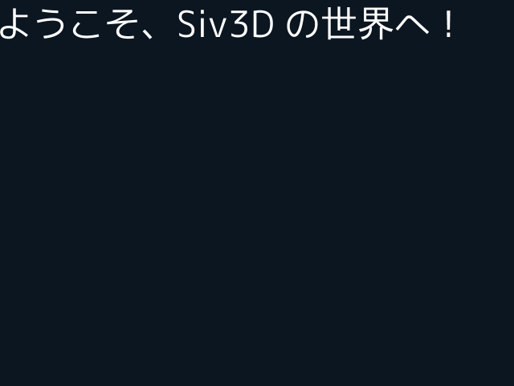
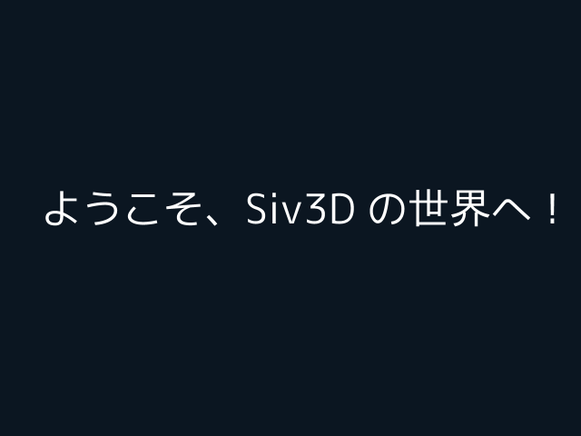
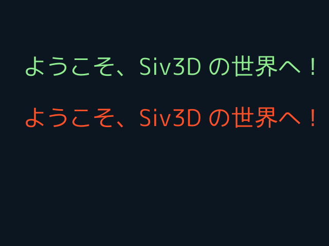
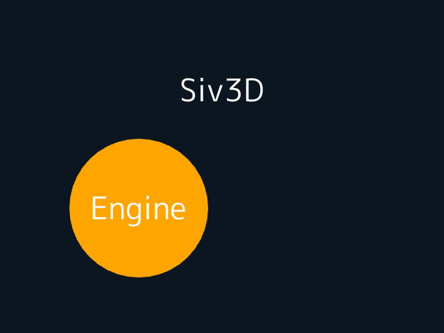
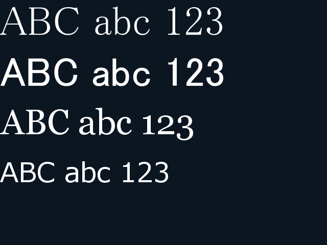
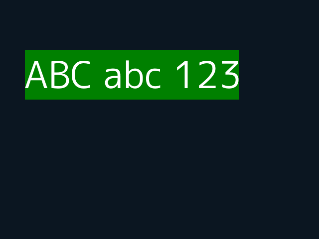
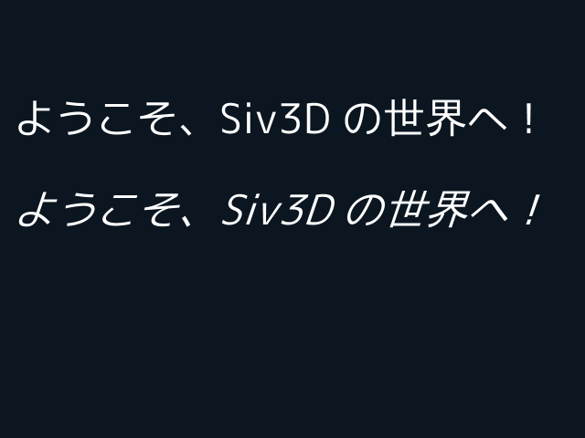
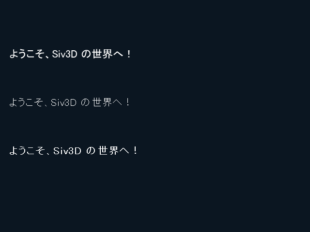
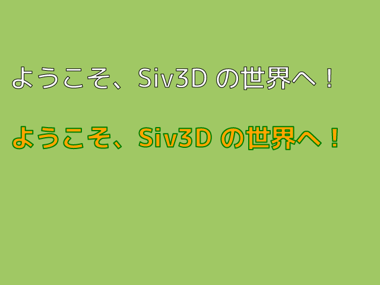
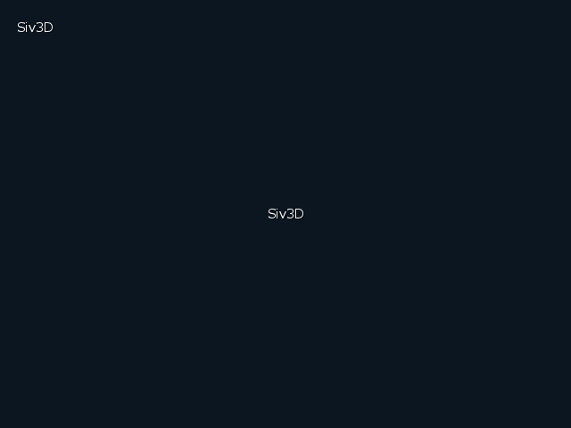

# 4. テキストを描く

## テキストを表示する
  
```cpp
# include <Siv3D.hpp>

void Main()
{
	// 大きさ 30 のフォントを用意
	const Font font(30);

	while (System::Update())
	{
		// テキストを表示する
		font(L"ようこそ、Siv3D の世界へ！").draw();
	}
}
```

## （注意）正しくないコード
`Font` をメインループで毎回作成するのは好ましくありません。
```cpp
// 間違ったプログラム
# include <Siv3D.hpp>

void Main()
{
	while (System::Update())
	{
		// NG!
		// フォントを毎フレーム作成・破棄するため動作が遅い
		Font(30)(L"ようこそ、Siv3D の世界へ！").draw();
	}
}
```

## 位置を変える
  
```cpp
# include <Siv3D.hpp>

void Main()
{
	const Font font(30);

	while (System::Update())
	{
		// 位置 (50, 200) からテキストを表示する
		font(L"ようこそ、Siv3D の世界へ！").draw(50, 200);
	}
}
```

## 色をつける
  
```cpp
# include <Siv3D.hpp>

void Main()
{
	const Font font(30);

	while (System::Update())
	{
		// テキストに色をつけて表示する
		font(L"ようこそ、Siv3D の世界へ！").draw(50, 100, Palette::Lightgreen);

		font(L"ようこそ、Siv3D の世界へ！").draw(50, 200, Color(255, 80, 40));
	}
}
```

## 改行する
 
テキストに `'\n'` があると改行します。  
```cpp
# include <Siv3D.hpp>

void Main()
{
	const Font font(30);

	while (System::Update())
	{
		font(L"古池や\n蛙飛びこむ\n水の音").draw();
	}
}
```

## 行の間隔を変える
  
```cpp
# include <Siv3D.hpp>

void Main()
{
	const Font font(30);

	while (System::Update())
	{
		// デフォルトの行間で表示する
		font(L"古池や\n蛙飛びこむ\n水の音").draw(0, 0, Palette::White, 1.0);

		// 1.2 倍の行間で表示する
		font(L"古池や\n蛙飛びこむ\n水の音").draw(300, 0, Palette::White, 1.2);
	}
}
```

## 中央に表示する
  
```cpp
# include <Siv3D.hpp>

void Main()
{
	const Font font(30);

	while (System::Update())
	{
		// 上から 100 の位置の中央にテキストを表示する
		font(L"Siv3D").drawCenter(100);

		Circle(200, 300, 100).draw(Palette::Orange);

		// 座標 (200, 300) を中心にテキストを表示する
		font(L"Engine").drawCenter(200, 300);
	}
}
```

## フォントの大きさ
  
```cpp
# include <Siv3D.hpp>

void Main()
{
	// 大きさ 10 のフォント
	const Font font1(10);

	// 大きさ 30 のフォント
	const Font font2(30);

	// 大きさ 50 のフォント
	const Font font3(50);

	const String text = L"ようこそ、Siv3D の世界へ！";

	while (System::Update())
	{
		font1(text).draw();

		font2(text).draw(0, 100);

		font3(text).draw(0, 200);
	}
}
```

## フォントの種類
  
```cpp
# include <Siv3D.hpp>

void Main()
{
	// デフォルトのフォント
	const Font fontDefault(35);

	// とても細い
	const Font fontThin(35, Typeface::Thin);

	// 細い
	const Font fontLight(35, Typeface::Light);

	// 普通
	const Font fontRegular(35, Typeface::Regular);

	// やや太い
	const Font fontMedium(35, Typeface::Medium);

	// 太い
	const Font fontBold(35, Typeface::Bold);

	// とても太い
	const Font fontHeavy(35, Typeface::Heavy);

	// 非常に太い
	const Font fontBlack(35, Typeface::Black);

	const String text = L"ABC abc 123 あいう";

	while (System::Update())
	{
		fontDefault(text).draw();

		fontThin(text).draw(0, 60);

		fontLight(text).draw(0, 120);

		fontRegular(text).draw(0, 180);

		fontMedium(text).draw(0, 240);

		fontBold(text).draw(0, 300);

		fontHeavy(text).draw(0, 360);

		fontBlack(text).draw(0, 420);
	}
}
```

## PC にインストールされているフォントを使う
  
```cpp
# include <Siv3D.hpp>

void Main()
{
	// フォント名を指定してフォントをロード
	const Font font1(40, L"ＭＳ Ｐ明朝");

	const Font font2(40, L"ＭＳ Ｐゴシック");

	const Font font3(40, L"Georgia");

	const Font font4(40, L"メイリオ");

	const String text = L"ABC abc 123";

	while (System::Update())
	{
		font1(text).draw();

		font2(text).draw(0, 100);

		font3(text).draw(0, 200);

		font4(text).draw(0, 300);
	}
}
```

## フォントをインストールして使う
  
コンピューターにインストールされていないフォントを使うには、フォントファイルを一時的にインストールします。  
インストールされたフォントはアプリケーションの終了時にアンインストールされます。
```cpp
# include <Siv3D.hpp>

void Main()
{
	// フォントファイルを一時的にインストール
	if (!FontManager::Register(L"Example/YomogiFont.ttf"))
	{
		// 失敗したら終了
		return;
	}

	// フォントファイルのフォント名を指定
	const Font font(40, L"よもぎフォント");

	while (System::Update())
	{
		font(L"よもぎフォント").draw();
	}
}
```

## テキストが表示される領域を調べる
  
```cpp
# include <Siv3D.hpp>

void Main()
{
	const Font font(50);

	while (System::Update())
	{
		// テキストが表示される領域を計算
		const Rect rect = font(L"ABC abc 123").region(50, 100);

		// 四角形を描画
		rect.draw(Palette::Green);

		// フォントを描画
		font(L"ABC abc 123").draw(50, 100);
	}
}
```

## ベースラインをそろえる
  
```cpp
# include <Siv3D.hpp>

void Main()
{
	const Font font1(10);

	const Font font2(30);

	const Font font3(50);

	while (System::Update())
	{
		font1(L"ABC").draw(50, 100 - font1.ascent);

		font2(L"ABC").draw(100, 100 - font2.ascent);

		font3(L"ABC").draw(200, 100 - font3.ascent);
	}
}
```

## イタリック体にする
  
```cpp
# include <Siv3D.hpp>

void Main()
{
	const Font font1(30, Typeface::Default);

	const Font font2(30, Typeface::Default, FontStyle::Italic);

	while (System::Update())
	{
		font1(L"ようこそ、Siv3D の世界へ！").draw(20, 100);

		font2(L"ようこそ、Siv3D の世界へ！").draw(20, 200);
	}
}
```

## ビットマップフォントを使う
  
```cpp
# include <Siv3D.hpp>

void Main()
{
	const Font font1(11, L"ＭＳ Ｐゴシック");

	const Font font2(11, L"ＭＳ Ｐゴシック", FontStyle::Bitmap);

	const Font font3(11, L"ＭＳ Ｐゴシック", FontStyle::BitmapBold);

	while (System::Update())
	{
		font1(L"ようこそ、Siv3D の世界へ！").draw(20, 100);

		font2(L"ようこそ、Siv3D の世界へ！").draw(20, 200);

		font3(L"ようこそ、Siv3D の世界へ！").draw(20, 300);
	}
}
```

## 文字を縁取りする
  
```cpp
# include <Siv3D.hpp>

void Main()
{
	Graphics::SetBackground(Color(160, 200, 100));

	const Font font1(30, Typeface::Medium, FontStyle::Outline);

	font1.changeOutlineStyle(TextOutlineStyle(Palette::Black, Palette::White, 1.0));

	const Font font2(30, Typeface::Heavy, FontStyle::Outline);

	font2.changeOutlineStyle(TextOutlineStyle(Palette::Green, Palette::Orange, 2.0));

	while (System::Update())
	{
		font1(L"ようこそ、Siv3D の世界へ！").draw(20, 100);

		font2(L"ようこそ、Siv3D の世界へ！").draw(20, 200);
	}
}
```

## テキストの簡易表示 1
  
`Println()` を使うと、`Font` を用意せず簡単にテキストを画面に出力できます。  
`Println()` で使われるフォントの色や大きさ、種類は変更できません。  
```cpp
# include <Siv3D.hpp>

void Main()
{
	while (System::Update())
	{
		Println(L"Siv3D");
	}
}
```

## テキストの簡易表示 2
  
`ClearPrint()` は `Println()` で画面に出力したテキストを消去します。
```cpp
# include <Siv3D.hpp>

void Main()
{
	while (System::Update())
	{
		ClearPrint();

		Println(L"Siv3D");
	}
}
```

## テキストの簡易表示 3
  
`PutText().from()`, `PutText().at()` を使ったテキストの簡易表示では座標を指定でき、表示したテキストは次のフレームで消去されます。
```cpp
# include <Siv3D.hpp>

void Main()
{
	while (System::Update())
	{
		// 座標 (20, 20) からテキストを簡易表示
		PutText(L"Siv3D").from(20, 20);

		// 座標 (320, 240) を中心にテキストを簡易表示
		PutText(L"Siv3D").at(320, 240);
	}
}
```

[← 前の章へ戻る](Draw-texture.md)　|　[- 目次 -](Index.md)　|　[次の章へ進む →](Formatting.md)