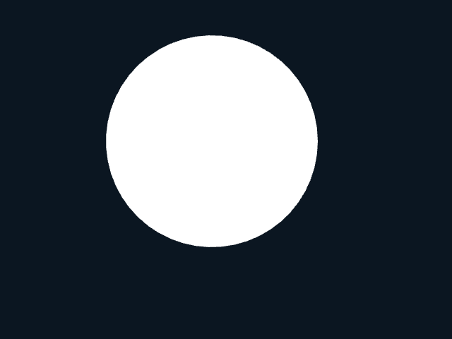
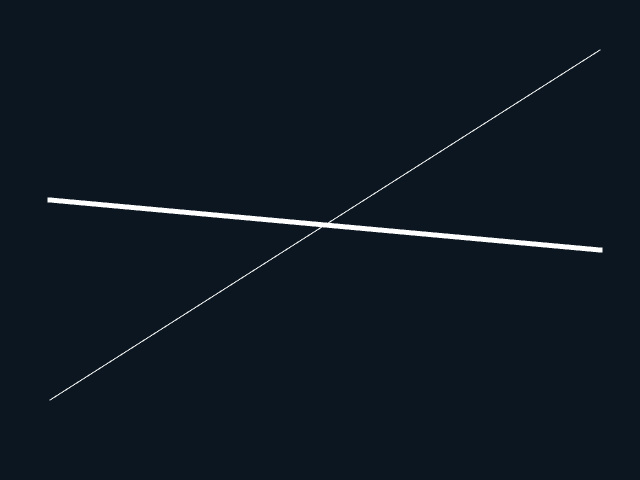
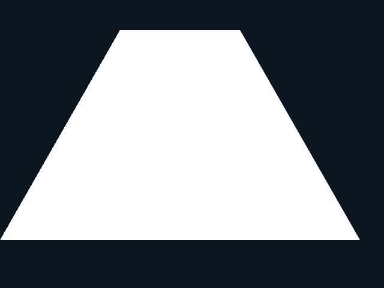
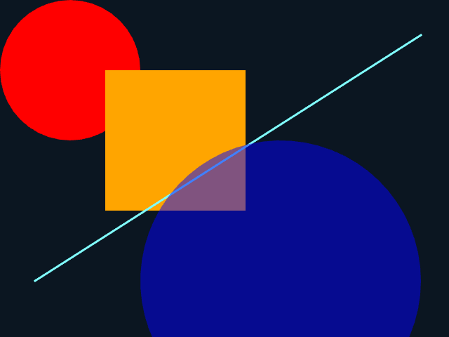
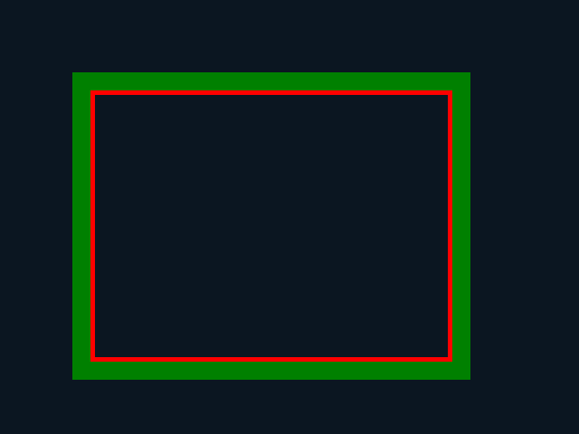
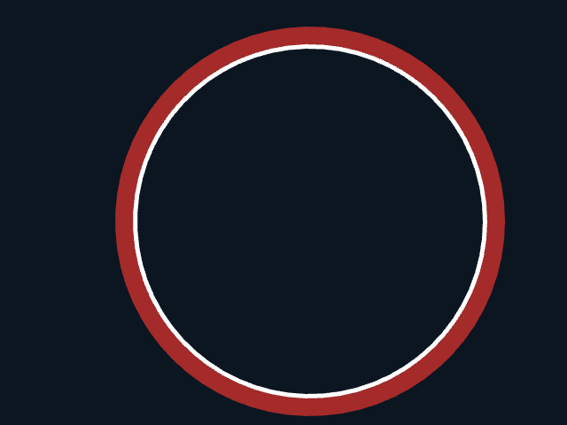
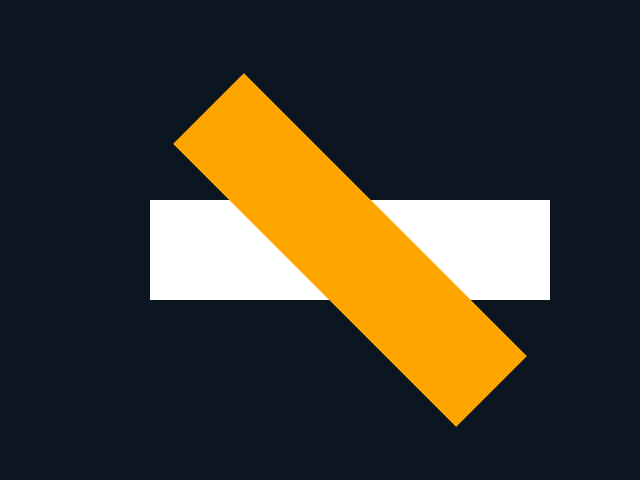
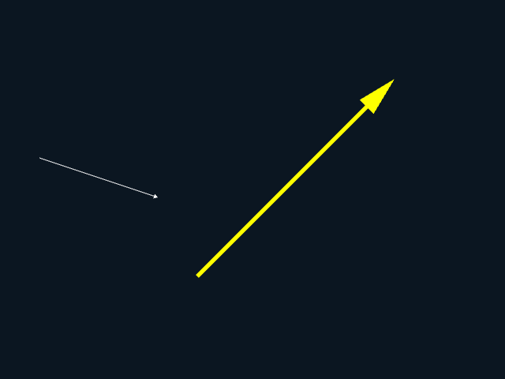

# 2. 図形を描く

## 円を描く
  
```cpp
# include <Siv3D.hpp>

void Main()
{
	while (System::Update())
	{
		// 中心 (300, 200) 半径 150 の円を描く
		Circle(300, 200, 150).draw();
	}
}
```

## 長方形を描く
  
```cpp
# include <Siv3D.hpp>

void Main()
{
	while (System::Update())
	{
		// 座標 (50, 100) から 幅 400, 高さ 200 の長方形を描く
		Rect(50, 100, 400, 200).draw();
	}
}
```

## 線を描く
  
```cpp
# include <Siv3D.hpp>

void Main()
{
	while (System::Update())
	{
		// 始点 (50, 400) 終点 (600, 50) の線分を描く
		Line(50, 400, 600, 50).draw();

		// 始点 (50, 200) 終点 (600, 250) 太さ 5 の線分を描く
		Line(50, 200, 600, 250).draw(5);
	}
}
```

## 三角形を描く
  
三角形の頂点は **時計回り** に指定します。
```cpp
# include <Siv3D.hpp>

void Main()
{
	while (System::Update())
	{
		// 3 点 (50, 50), (600, 400), (100, 400) を頂点とする三角形を描く
		Triangle(Vec2(50, 50), Vec2(600, 400), Vec2(100, 400)).draw();
	}
}
```
`Vec2(x, y)` は `{ x, y }` とも書けます。
```cpp
# include <Siv3D.hpp>

void Main()
{
	while (System::Update())
	{
		// 3 点 (50, 50), (600, 400), (100, 400) を頂点とする三角形を描く
		Triangle({ 50, 50 }, { 600, 400 }, { 100, 400 }).draw();
	}
}
```

## 四角形を描く
  
四角形の頂点は **時計回り** に指定します。  
180° 以上の凹の角を含む場合は `Polygon` を使ってください。  
```cpp
# include <Siv3D.hpp>

void Main()
{
	while (System::Update())
	{
		// 4 点 (200, 50), (400, 50), (600, 400), (0, 400) を頂点とする四角形を描く
		Quad({ 200, 50 }, { 400, 50 }, { 600, 400 }, { 0, 400 }).draw();
	}
}
```

## 角丸長方形を描く
  
```cpp
# include <Siv3D.hpp>

void Main()
{
	while (System::Update())
	{
		// 座標 (50, 100) から 幅 400, 高さ 200, 角の半径 40 の角丸長方形を描く
		RoundRect(50, 100, 400, 200, 40).draw();
	}
}
```

## 多角形を描く
  
多角形の頂点は **時計回り** に指定します。  
```cpp
# include <Siv3D.hpp>

void Main()
{
	// 多角形を作成
	const Polygon star
	{
		{ 0, -200 },{ 40, -60 },
		{ 180, -60 },{ 75, 25 },
		{ 115, 160 },{ 0, 80 },
		{ -115, 160 },{ -75, 25 },
		{ -180, -60 },{ -40, -60 }
	};

	while (System::Update())
	{
		// 多角形を本来の位置に描く
		star.draw();

		// 多角形を (400, 300) 移動させた位置に描く
		star.draw(400, 300);
	}
}
```

## 色のついた図形を描く
  
`Palette::色名`, `Color(r,g,b)`, `Color(r,g,b,a)` などで色を指定します。
```cpp
# include <Siv3D.hpp>

void Main()
{
	while (System::Update())
	{
		// 赤い円を描く
		Circle(100, 100, 100).draw(Palette::Red);

		// オレンジの長方形を描く
		Rect(150, 100, 200, 200).draw(Palette::Orange);

		// RGB(128, 255, 255) 太さ 3 の線分を描く
		Line(50, 400, 600, 50).draw(3, Color(128, 255, 255));

		// RGB(0, 0, 255) 不透明度 127 の円を描く
		Circle(400, 400, 200).draw(Color(0, 0, 255, 127));
	}
}
```
`Color(r,g,b)` や `Color(r,g,b,a)` は `{ }` で表現することもできます。  
```cpp
# include <Siv3D.hpp>

void Main()
{
	while (System::Update())
	{
		// 赤い円を描く
		Circle(100, 100, 100).draw(Palette::Red);

		// オレンジの長方形を描く
		Rect(150, 100, 200, 200).draw(Palette::Orange);

		// RGB(128, 255, 255) 太さ 3 の線分を描く
		Line(50, 400, 600, 50).draw(3, { 128, 255, 255 });

		// RGB(0, 0, 255) 不透明度 127 の円を描く
		Circle(400, 400, 200).draw({ 0, 0, 255, 127 });
	}
}
```

## 長方形の枠を描く
  
```cpp
# include <Siv3D.hpp>

void Main()
{
	const Rect rect(100, 100, 400, 300);

	while (System::Update())
	{
		// 長方形の内側に太さ 5 の赤い枠を描く
		rect.drawFrame(5, 0, Palette::Red);

		// 長方形の外側に太さ 20 の緑の枠を描く
		rect.drawFrame(0, 20, Palette::Green);
	}
}
```

## 円の枠を描く
  
```cpp
# include <Siv3D.hpp>

void Main()
{
	const Circle circle(350, 250, 200);

	while (System::Update())
	{
		// 円の内側に太さ 5 の白い枠を描く
		circle.drawFrame(5, 0);

		// 円の外側に太さ 20 の茶色い枠を描く
		circle.drawFrame(0, 20, Palette::Brown);
	}
}
```

## 回転した長方形を描く
  
時計回りの回転角度を **ラジアン角** で指定します。  
```cpp
# include <Siv3D.hpp>

void Main()
{
	// 回転角度 (45°)
	const double degree = 45;

	// ラジアン角に変換
	const double radian = Radians(degree);

	// 長方形
	const Rect rect(150, 200, 400, 100);

	while (System::Update())
	{
		rect.draw();

		// 回転した長方形をオレンジ色で描く
		rect.rotated(radian).draw(Palette::Orange);
	}
}
```
度数法のリテラル `_deg` を使うこともできます。
```cpp
# include <Siv3D.hpp>

void Main()
{
	// 長方形
	const Rect rect(150, 200, 400, 100);

	while (System::Update())
	{
		rect.draw();

		// 45° 回転した長方形をオレンジ色で描く
		rect.rotated(45_deg).draw(Palette::Orange);
	}
}
```

## 複数の点をつないだ線を描く
  
```cpp
# include <Siv3D.hpp>

void Main()
{
	// 線を作成
	const LineString line
	{
		{ 50, 100 },{ 600, 100 },
		{ 50, 200 },{ 600, 200 },
		{ 50, 300 },{ 600, 300 },
		{ 50, 400 }
	};

	while (System::Update())
	{
		// 黄色い線を太さ 3 で描く
		line.draw(3, Palette::Yellow);
	}
}
```

## 矢印を描く
  
```cpp
# include <Siv3D.hpp>

void Main()
{
	while (System::Update())
	{
		// 始点 (50, 200) 終点 (200, 250) の矢印を描く
		Line(50, 200, 200, 250).drawArrow();

		// 線の幅 5, 三角の幅 20, 高さ 50 の矢印を描く
		Line(250, 350, 500, 100).drawArrow(5, { 20, 50 }, Palette::Yellow);
	}
}
```

## スプライン曲線を描く
  
すべての制御点を通過する滑らかな曲線を描きます。引数 isClosedCurve を true にすると 1 周する閉曲線になります。
```cpp
# include <Siv3D.hpp>

void Main()
{
	const LineString line
	{
		{ 50, 50 },{ 200, 200 },
		{ 400, 200 },{ 100, 400 },
		{ 500, 400 }
	};

	while (System::Update())
	{
		// 線の幅 8 のスプライン曲線を描く
		line.drawCatmullRomSpline(8.0);
	}
}
```

## ベジェ曲線を描く
  
```cpp
# include <Siv3D.hpp>

void Main()
{
	QuadraticBezier quadraticBezier({ 100, 400 }, { 100, 250 }, { 300, 100 });

	CubicBezier cubicBezier({ 300, 400 }, { 400, 400 },
		{ 400, 100 }, { 500, 100 });

	while (System::Update())
	{
		// 線の幅 4 の 2 次ベジェ曲線を描く
		quadraticBezier.draw(4.0);

		// 線の幅 2 の 3 次ベジェ曲線をオレンジ色で描く
		cubicBezier.draw(2.0, Palette::Orange);
	}
}
```

[← 前の章へ戻る](Getting-started-with-siv3d.md)　|　[- 目次 -](Index.md)　|　[次の章へ進む →](Draw-texture.md)