# 3. テクスチャを描く

## テクスチャを描く
  
画像ファイルを読み込み、描画可能な `Texture` を作成します。
```cpp
# include <Siv3D.hpp>

void Main()
{
	// テクスチャを画像ファイルからロード
	const Texture texture(L"Example/Windmill.png");

	while (System::Update())
	{
		// テクスチャを描く
		texture.draw();
	}
}
```

## 位置を変える
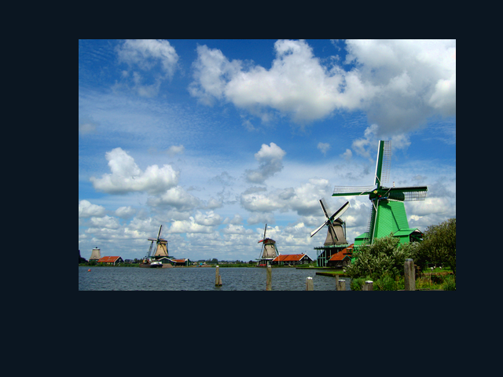  
```cpp
# include <Siv3D.hpp>

void Main()
{
	const Texture texture(L"Example/Windmill.png");

	while (System::Update())
	{
		// 位置 (100, 50) にテクスチャを描く
		texture.draw(100, 50);
	}
}
```

## テクスチャの一部だけを描く
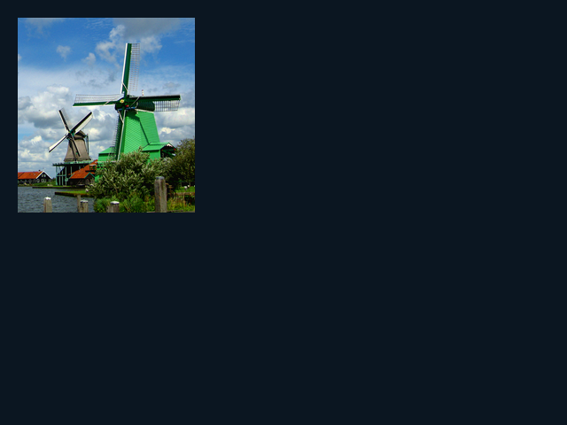  
```cpp
# include <Siv3D.hpp>

void Main()
{
	const Texture texture(L"Example/Windmill.png");

	while (System::Update())
	{
		// テクスチャ内のピクセル (260, 100) から 幅 200, 高さ 220 の範囲を
		// 位置 (20, 20) に描く
		texture(260, 100, 200, 220).draw(20, 20);
	}
}
```

## 左右反転する
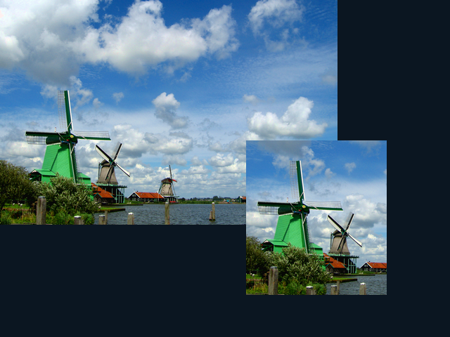  
```cpp
# include <Siv3D.hpp>

void Main()
{
	const Texture texture(L"Example/Windmill.png");

	while (System::Update())
	{
		// テクスチャを反転して描く
		texture.mirror().draw();

		// テクスチャ内のピクセル (260, 100) から 幅 200, 高さ 220 の範囲を
		// 左右反転して
		// 位置 (350, 200) に描く
		texture(260, 100, 200, 220).mirror().draw(350, 200);
	}
}
```

## 上下反転する
  
```cpp
# include <Siv3D.hpp>

void Main()
{
	const Texture texture(L"Example/Windmill.png");

	while (System::Update())
	{
		// テクスチャを反転させて描く
		texture.flip().draw();

		// テクスチャ内のピクセル (260, 100) から 幅 200, 高さ 220 の範囲を
		// 上下反転させて
		// 位置 (20, 20) に描く
		texture(260, 100, 200, 220).flip().draw(350, 200);
	}
}
```

## 倍率を指定して拡大縮小する
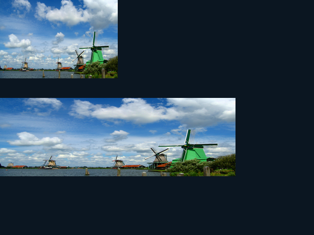  
```cpp
# include <Siv3D.hpp>

void Main()
{
	const Texture texture(L"Example/Windmill.png");

	while (System::Update())
	{
		// テクスチャを 0.5 倍に縮小して描く
		texture.scale(0.5).draw();

		// テクスチャを 横 1.0 倍、縦 0.5 倍に縮小して
		// 位置 (0, 200) に描く
		texture.scale(1.0, 0.5).draw(0, 200);
	}
}
```

## サイズを指定して拡大縮小する
  
```cpp
# include <Siv3D.hpp>

void Main()
{
	const Texture texture(L"Example/Windmill.png");

	while (System::Update())
	{
		// テクスチャを 縦 640, 横 480 ドットに拡大して描く
		texture.resize(640, 480).draw();
	}
}
```

## 繰り返しマッピングする
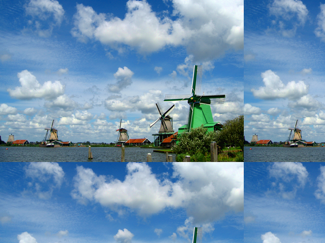  
```cpp
# include <Siv3D.hpp>

void Main()
{
	const Texture texture(L"Example/Windmill.png");

	while (System::Update())
	{
		// テクスチャを 縦 640, 横 480 ドットの範囲に繰り返しマッピングして描く
		texture.map(640, 480).draw();
	}
}
```

## 回転させる
  
時計回りの回転角度を **ラジアン角** で指定します。
```cpp
# include <Siv3D.hpp>

void Main()
{
	const Texture texture(L"Example/Windmill.png");

	while (System::Update())
	{
		// テクスチャを -15° 回転して描く
		texture.rotate(Radians(-15)).draw();

		// テクスチャ内のピクセル (260, 100) から 幅 200, 高さ 220 の範囲を
		// 15° 回転して
		// 位置 (350, 200) に描く
		texture(260, 100, 200, 220).rotate(15_deg).draw(350, 200);
	}
}
```

## 中心を指定して回転させる
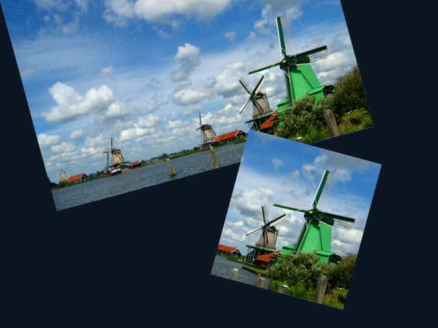  
```cpp
# include <Siv3D.hpp>

void Main()
{
	const Texture texture(L"Example/Windmill.png");

	while (System::Update())
	{
		// テクスチャ内の位置 (0, 0) を中心に-15° 回転して描く
		texture.rotateAt(0, 0, Radians(-15)).draw();

		// テクスチャ内のピクセル (260, 100) から 幅 200, 高さ 220 の範囲を
		// その範囲内の位置 (50, 50) を中心に 15° 回転して
		// 位置 (350, 200) に描く
		texture(260, 100, 200, 220).rotateAt(50, 50, 15_deg).draw(350, 200);
	}
}
```

## 長方形にテクスチャを貼り付ける
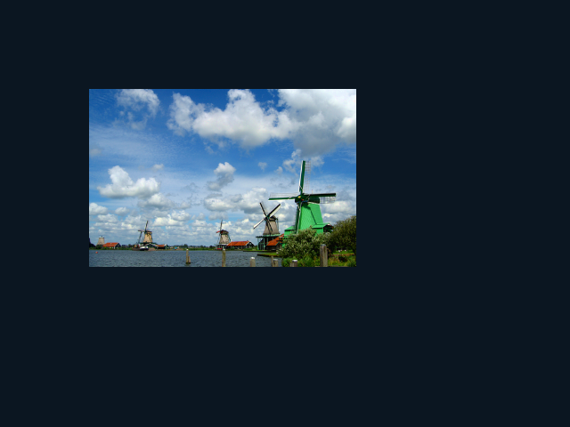  
```cpp
# include <Siv3D.hpp>

void Main()
{
	const Texture texture(L"Example/Windmill.png");

	while (System::Update())
	{
		// 位置 (100, 100) から 幅 300, 高さ 200 の長方形に
		// テクスチャを貼り付けて描く
		Rect(100, 100, 300, 200)(texture).draw();
	}
}
```

## 長方形にテクスチャの一部だけを貼り付ける
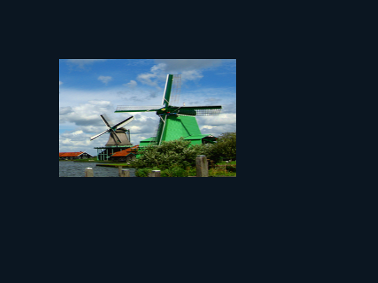  
```cpp
# include <Siv3D.hpp>

void Main()
{
	const Texture texture(L"Example/Windmill.png");

	while (System::Update())
	{
		// 位置 (100, 100) から 幅 300, 高さ 200 の長方形に
		// テクスチャ内のピクセル (260, 100) から 幅 200, 高さ 220 の範囲を
		// 貼り付けて描く
		Rect(100, 100, 300, 200)(texture(260, 100, 200, 220)).draw();
	}
}
```

## 回転した長方形にテクスチャを貼り付ける
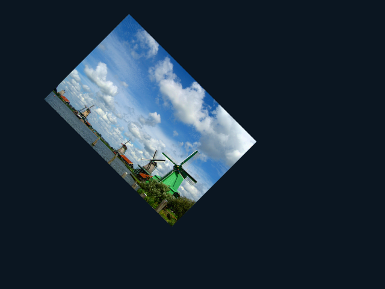  
```cpp
# include <Siv3D.hpp>

void Main()
{
	const Texture texture(L"Example/Windmill.png");

	while (System::Update())
	{
		// 位置 (100, 100) から 幅 300, 高さ 200 の長方形を
		// 45° 回転させ、
		// そこにテクスチャを貼り付けて描く
		Rect(100, 100, 300, 200).rotated(45_deg)(texture).draw();
	}
}
```

## テクスチャを透過させる
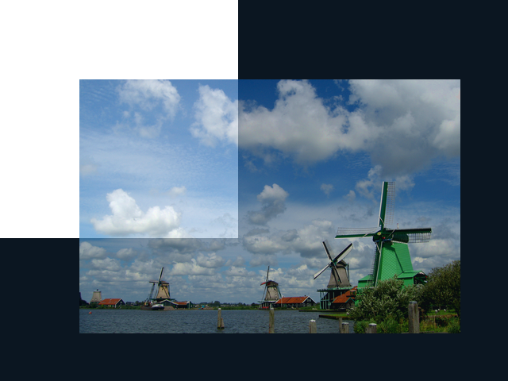  
```cpp
# include <Siv3D.hpp>

void Main()
{
	const Texture texture(L"Example/Windmill.png");

	while (System::Update())
	{
		// 背景に白い四角を描く
		Rect(0, 0, 300, 300).draw();

		// テクスチャのアルファ値（不透明度）を 180 に設定して
		// 位置 (100, 100) に描く
		texture.draw(100, 100, Alpha(180));
	}
}
```
`Color(r, g, b, a)` で指定することもできます。
```cpp
# include <Siv3D.hpp>

void Main()
{
	const Texture texture(L"Example/Windmill.png");

	while (System::Update())
	{
		// 背景に白い四角を描く
		Rect(0, 0, 300, 300).draw();

		// テクスチャのアルファ値（不透明度）を 180 に設定して
		// 位置 (100, 100) に描く
		texture.draw(100, 100, Color(255, 255, 255, 180));
	}
}
```

## 色を乗算して描く
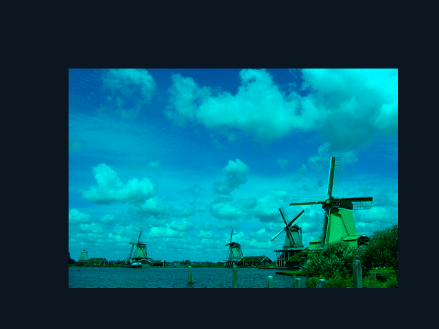  
```cpp
# include <Siv3D.hpp>

void Main()
{
	const Texture texture(L"Example/Windmill.png");

	while (System::Update())
	{
		// テクスチャを RGB(0, 255, 255) と乗算して
		// 位置 (100, 100) に描く
		texture.draw(100, 100, Color(0, 255, 255));
	}
}
```

## テクスチャの幅と高さを取得する
  
```cpp
# include <Siv3D.hpp>

void Main()
{
	const Texture texture(L"Example/Windmill.png");

	// テクスチャの幅
	const int32 width = texture.width;

	// テクスチャの高さ
	const int32 height = texture.height;

	while (System::Update())
	{
		// テクスチャと同じ大きさの長方形を描く
		Rect(0, 0, width, height).draw(Palette::Skyblue);
	}
}
```

## 中心の位置を指定して描く
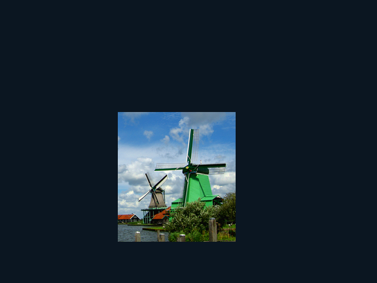  
```cpp
# include <Siv3D.hpp>

void Main()
{
	const Texture texture(L"Example/Windmill.png");

	while (System::Update())
	{
		// テクスチャ内のピクセル (260, 100) から 幅 200, 高さ 220 の範囲を
		// 中心が (300, 300) になる位置に描く
		texture(260, 100, 200, 220).drawAt(300, 300);
	}
}
```

## UV 座標を指定してテクスチャの一部だけを切り抜いて描く
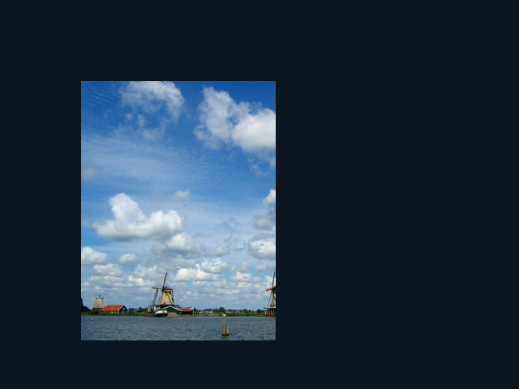  
```cpp
# include <Siv3D.hpp>

void Main()
{
	const Texture texture(L"Example/Windmill.png");

	while (System::Update())
	{
		// テクスチャの UV 座標 (0.0, 0.0) から
		// 幅 0.5, 高さ 1.0 の範囲を
		// 位置 (100, 100) に描く
		texture.uv(0.0, 0.0, 0.5, 1.0).draw(100, 100);
	}
}
```

## テクスチャの作成失敗を確認する
画像ファイルが存在しなかった場合などに、Texture の作成に失敗することがあります。  
テクスチャの作成に失敗していないかを調べるには `!` 演算子を使います。  
なお、Siv3D では作成に失敗した Texture を使用しても問題は起こりません。代わりに黄色い 16x16 の画像が設定されます。  
```cpp
# include <Siv3D.hpp>

void Main()
{
	const Texture texture(L"Example/aaa.png");

	if (!texture)
	{
		// 読み込みに失敗したら終了
		return;
	}

	while (System::Update())
	{
		// テクスチャを描く
		texture.draw();
	}
}
```

[← 前の章へ戻る](Draw-shape.md)　|　[- 目次 -](Index.md)　|　[次の章へ進む →](Draw-font.md)