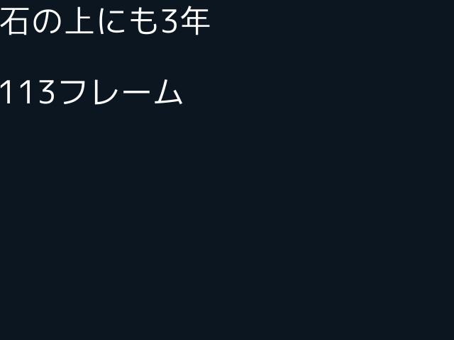
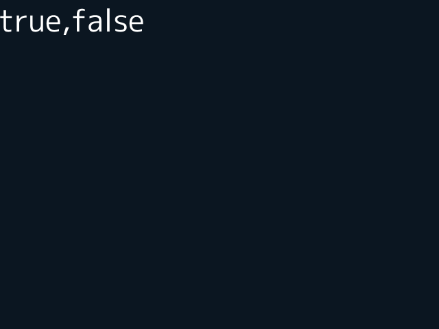
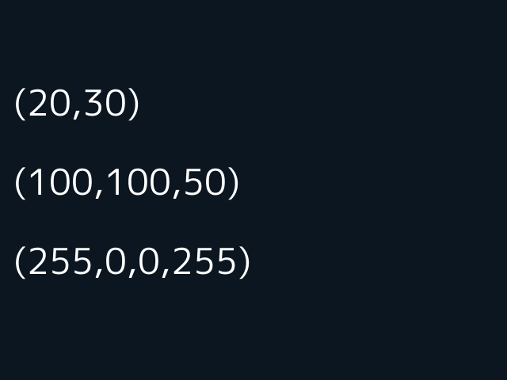
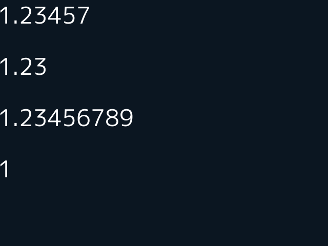
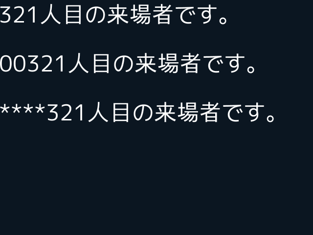
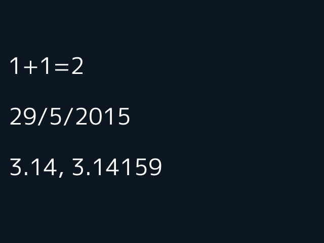

# 5. 文字列と数値の変換

## String 型
  
```cpp
# include <Siv3D.hpp>

void Main()
{
	const Font font(30);

	// String 型は文字列を保持する
	const String text = L"プログラミング";

	while (System::Update())
	{
		font(text).draw();
	}
}
```

## 文字列の結合
  
```cpp
# include <Siv3D.hpp>

void Main()
{
	const Font font(30);

	const String text = L"プログラミング";

	// + で文字列を結合する
	const String text2 = text + L"C++";

	while (System::Update())
	{
		font(text2).draw();
	}
}
```

## 文字の追加
  
```cpp
# include <Siv3D.hpp>

void Main()
{
	const Font font(30);

	String text = L"プログラミング";

	text += L"C+";	// L"C+" を追加

	text.push_back(L'+');	// L'+' を追加

	while (System::Update())
	{
		font(text).draw();
	}
}
```

## 部分文字列
  
```cpp
# include <Siv3D.hpp>

void Main()
{
	const Font font(30);

	const String text = L"プログラミングC++";

	while (System::Update())
	{
		// text のインデックス 0 番目から 3 文字までを取り出す
		font(text.substr(0, 3)).draw(0, 0);

		// text のインデックス 0 番目から 5 文字までを取り出す
		font(text.substr(0, 5)).draw(0, 100);

		// text のインデックス 7 番目から 3 文字までを取り出す
		font(text.substr(7, 3)).draw(0, 200);
	}
}
```

## 数値を文字列に変換する
  
```cpp
# include <Siv3D.hpp>

void Main()
{
	const Font font(30);

	// Format() 内で
	// , 区切りでデータを記述する
	const String text = Format(L"石の上にも", 1 + 2, L"年");

	int32 frame = 0;	// 今、何フレーム目かを数える

	while (System::Update())
	{
		font(text).draw(0, 0);

		// Font::operator() は Format と同じ働きをする
		font(frame, L"フレーム").draw(0, 100);

		++frame;
	}
}
```

## bool 値を文字列に変換する
  
```cpp
# include <Siv3D.hpp>

void Main()
{
	const Font font(30);

	const bool a = true;

	const bool b = false;

	while (System::Update())
	{
		// bool 値はそれぞれ L"true", L"false" という文字列に変換される
		font(a, L',', b).draw();
	}
}
```

## 配列を文字列に変換する
  
```cpp
# include <Siv3D.hpp>

void Main()
{
	const Font font(30);

	const int32 a[4] = { 10, 20, 30, 40 };

	const double f[3] = { 0.1, 0.2, 0.3 };

	while (System::Update())
	{
		font(a).draw(20, 100);

		font(f).draw(20, 200);
	}
}
```

## ベクトル / 図形 / カラー型を文字列に変換する
  
```cpp
# include <Siv3D.hpp>

void Main()
{
	const Font font(30);

	while (System::Update())
	{
		font(Point(20, 30)).draw(20, 100);

		font(Circle(100, 100, 50)).draw(20, 200);

		font(Palette::Red).draw(20, 300);
	}
}
```

## 桁数を指定して小数を文字列に変換する
  
```cpp
# include <Siv3D.hpp>

void Main()
{
	const Font font(30);

	const double value = 1.23456789;

	while (System::Update())
	{
		// double 型は有効桁数 6 桁まで文字列に変換
		// それ以下は四捨五入される
		font(value).draw(0, 0);

		// 小数第 2 位 まで変換
		font(DecimalPlace(2), value).draw(0, 100);
		
		// DecimalPlace() の代わりに _dp リテラルも使える
		// 小数第 8 位 まで変換
		font(8_dp, value).draw(0, 200);

		// 整数部分のみ
		font(0_dp, value).draw(0, 300);
	}
}
```

## 幅と埋め文字を指定して数値を文字列に変換する
  
```cpp
# include <Siv3D.hpp>

void Main()
{
	const Font font(30);

	const int32 counter = 321;

	while (System::Update())
	{
		font(counter, L"人目の来場者です。").draw(0, 0);

		// 幅を 5, 埋め文字を L'0' にして数値を変換
		font(Pad(counter, { 5, L'0' }), L"人目の来場者です。").draw(0, 100);

		// 幅を 7, 埋め文字を L'*' にして数値を変換
		font(Pad(counter, { 7, L'*' }), L"人目の来場者です。").draw(0, 200);
	}
}
```

## Python スタイルの Format
  
第 1 引数を _fmt リテラルのついた文字列にすると、Python スタイルの Format になります。
```cpp
# include <Siv3D.hpp>

void Main()
{
	const Font font(30);

	while (System::Update())
	{
		font(L"{}+{}={}"_fmt, 1, 1, 1 + 1).draw(20, 100);

		font(L"{2}/{1}/{0}"_fmt, 2015, 5, 29).draw(20, 200);

		font(L"{:.2f}, {:.5f}"_fmt, Pi, Pi).draw(20, 300);
	}
}
```

## Println, PutText
  
`Println()` や `PutText()` も `Font::operator()` と同様に数値を文字列に変換できます。
```cpp
# include <Siv3D.hpp>

void Main()
{
	Println(L"abc", 123);

	Println(L"{2}/{1}/{0}"_fmt, 2015, 5, 29);

	int32 i = 0;

	while (System::Update())
	{
		PutText(++i).from(100, 100);

		PutText(L"Siv3D ", Palette::Red, L" ", Pi).at(Mouse::Pos());
	}
}
```

## 文字列からデータ型への変換
  
```cpp
# include <Siv3D.hpp>

void Main()
{
	const int32 a = Parse<int>(L"123");

	const double b = Parse<double>(L"3.14");

	const Circle c = Parse<Circle>(L"(200, 200, 60)");

	const Font font(30);

	while (System::Update())
	{
		font(a).draw(20, 100);

		font(b).draw(20, 200);

		font(c).draw(20, 300);
	}
}
```

[← 前の章へ戻る](Draw-font.md)　|　[- 目次 -](Index.md)　|　[次の章へ進む →](Key.md)