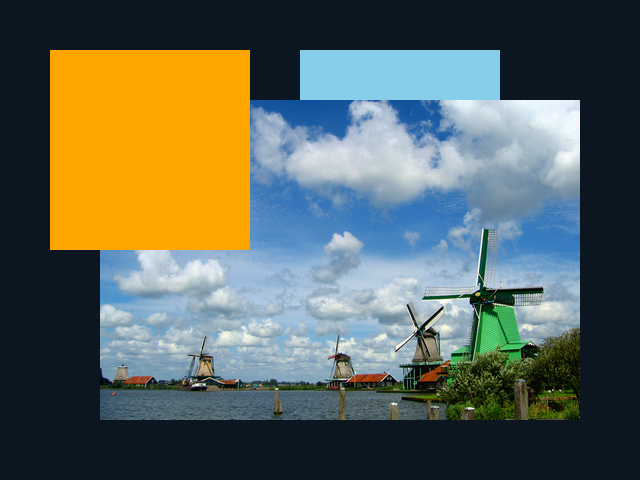
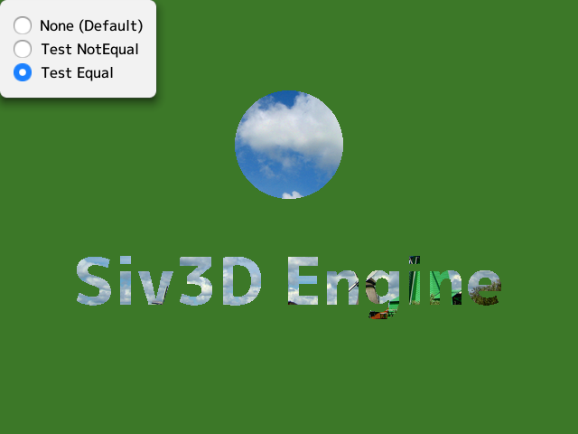
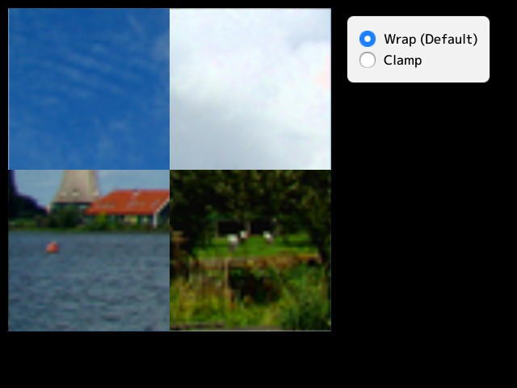
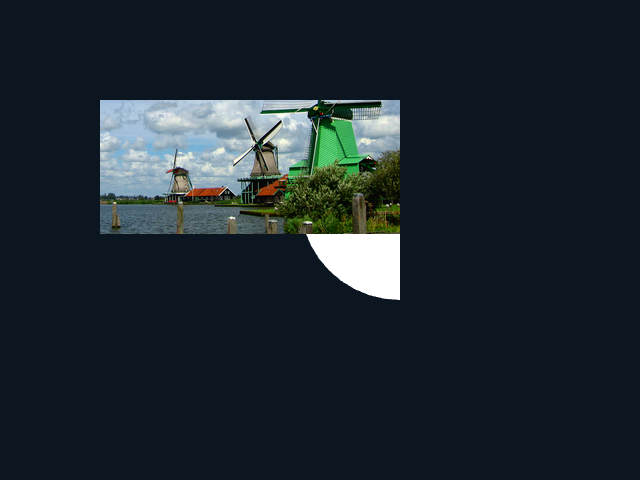

# 28. 2D のレンダーステート

## ブレンドステート
  
アルファブレンドの方法を変更できます。
```cpp
# include <Siv3D.hpp>

void Main()
{
	const Texture texture(L"Example/Windmill.png");

	GUI gui(GUIStyle::Default);
	gui.add(L"method", GUIRadioButton::Create(
	{ L"Default", L"Additive", L"Subtractive", L"Multiplicative", L"Multiplicative2X", L"Opaque" }, 0u, true));

	while (System::Update())
	{
		Graphics2D::SetBlendState(BlendState::Default);

		Rect(0, 320, 160, 160).draw();

		texture.draw();

		switch (gui.radioButton(L"method").checkedItem.value())
		{
		case 0:
			Graphics2D::SetBlendState(BlendState::Default);
			break;
		case 1:
			Graphics2D::SetBlendState(BlendState::Additive);
			break;
		case 2:
			Graphics2D::SetBlendState(BlendState::Subtractive);
			break;
		case 3:
			Graphics2D::SetBlendState(BlendState::Multiplicative);
			break;
		case 4:
			Graphics2D::SetBlendState(BlendState::Multiplicative2X);
			break;
		case 5:
			Graphics2D::SetBlendState(BlendState::Opaque);
			break;
		}

		Rect(Mouse::Pos() - Point(80, 80), 80, 80).draw(Color(64, 128, 255, 120));

		texture.draw(Mouse::Pos());
	}
}
```

## ラスタライザーステート
  
ワイヤフレームでの描画ができます。  
```cpp
# include <Siv3D.hpp>

void Main()
{
	const Texture texture(L"Example/Windmill.png");

	GUI gui(GUIStyle::Default);
	gui.add(L"method", GUIRadioButton::Create(
	{ L"Default2D", L"WireframeCullNone" }, 0u, true));

	while (System::Update())
	{
		switch (gui.radioButton(L"method").checkedItem.value())
		{
		case 0:
			Graphics2D::SetRasterizerState(RasterizerState::Default2D);
			break;
		case 1:
			Graphics2D::SetRasterizerState(RasterizerState::WireframeCullNone);
			break;
		}

		texture.draw(10, 10);

		Circle(400, 200, 100).draw();

		Circle(100, 400, 20).draw();

		Rect(200, 300, 80, 80).draw();
	}
}
```

## デプスステート
  
デプスを有効にすると、Z 値を利用した前後関係の指定が可能になります。Z が大きいものが上に描かれ、小さいものは隠されます。  
描画順を変えるものではないため、半透明なものの描画には注意が必要です。  
```cpp
# include <Siv3D.hpp>

void Main()
{
	Graphics2D::SetDepthState(DepthState::TestWrite);

	const Texture texture(L"Example/Windmill.png");

	while (System::Update())
	{
		Graphics2D::SetZ(2);

		Rect(50, 50, 200, 200).draw(Palette::Orange);

		Graphics2D::SetZ(0);

		Rect(300, 50, 200, 200).draw(Palette::Skyblue);

		Graphics2D::SetZ(1);

		texture.draw(100, 100);
	}
}
```

## ステンシルステート
  
ステンシルへの書き込みと、ステンシルテストを有効にした描画が可能になります。
```cpp
# include <Siv3D.hpp>

void Main()
{
	Graphics::SetBackground(Color(60, 120, 40));

	const Texture texture(L"Example/Windmill.png");
	const Font font(50, Typeface::Heavy);

	GUI gui(GUIStyle::Default);
	gui.add(L"method", GUIRadioButton::Create(
	{ L"None (Default)", L"Test NotEqual", L"Test Equal" }, 0u, true));

	while (System::Update())
	{
		Graphics2D::SetStencilState(StencilState::Replace);
		Graphics2D::SetStencilValue(1);

		Circle(320, 160, 60).draw();
		font(L"Siv3D Engine").drawCenter(260);

		switch (gui.radioButton(L"method").checkedItem.value())
		{
		case 0:
			Graphics2D::SetStencilState(StencilState::None);
			break;
		case 1:
			Graphics2D::SetStencilState(StencilState::Test(StencilFunc::NotEqual));
			break;
		case 2:
			Graphics2D::SetStencilState(StencilState::Test(StencilFunc::Equal));
			break;
		}

		texture.drawAt(320, 240);
	}
}
```

## サンプラーステート（サンプリングモード）
  
テクスチャを拡大縮小して描画した際のサンプリングモードを変更できます。  
例えば、ドット絵を拡大したときに、なめらかに線形補間するのではなく、ドット感を保ったまま拡大するといったことが可能になります。
```cpp
# include <Siv3D.hpp>

void Main()
{
	const Texture unmipped(L"Example/Windmill.png");
	const Texture mipped(L"Example/Windmill.png", TextureDesc::Mipped);

	GUI gui(GUIStyle::Default);
	gui.add(L"method", GUIRadioButton::Create(
	{ L"Point", L"Mipped + Point", L"Linear (Default2D)", L"Mipped + Linear" }, 2u, true));

	gui.setPos(50, 300);

	while (System::Update())
	{
		TextureRegion t;

		switch (gui.radioButton(L"method").checkedItem.value())
		{
		case 0:
			Graphics2D::SetSamplerState(SamplerState::WrapPoint);
			t = unmipped(300, 200, 100, 100);
			break;
		case 1:
			Graphics2D::SetSamplerState(SamplerState::WrapPoint);
			t = mipped(300, 200, 100, 100);
			break;
		case 2:
			Graphics2D::SetSamplerState(SamplerState::WrapLinear);
			t = unmipped(300, 200, 100, 100);
			break;
		case 3:
			Graphics2D::SetSamplerState(SamplerState::WrapLinear);
			t = mipped(300, 200, 100, 100);
			break;
		}

		t.scale(1.0 / 3.0).draw(40, 60);

		t.scale(1.0 / 2.0).draw(100, 60);

		t.scale(1.0).draw(180, 60);

		t.scale(4).draw(300, 60);
	}
}
```

## サンプラーステート（テクスチャアドレスモード）
  
テクスチャのサンプリング時にフィルタがかかると、反対の境界の色が表れることがあります。（U 座標 1.0 のピクセルの色を決定する際に 1.01 (=0.01) のピクセルを参照した場合など）  
テクスチャアドレスモードをクランプモードにすると、UV 値が 0.0～1.0 に制限され、画像の境界における色のにじみを防げます。
```cpp
# include <Siv3D.hpp>

void Main()
{
	Graphics::SetBackground(Palette::Black);

	const Texture texture(L"Example/Windmill.png");

	GUI gui(GUIStyle::Default);
	gui.add(L"method", GUIRadioButton::Create(
	{ L"Wrap (Default)", L"Clamp" }, 0u, true));
	gui.setPos(430, 20);

	while (System::Update())
	{
		switch (gui.radioButton(L"method").checkedItem.value())
		{
		case 0:
			Graphics2D::SetSamplerState(SamplerState::WrapLinear);
			break;
		case 1:
			Graphics2D::SetSamplerState(SamplerState::ClampLinear);
			break;
		}

		texture(0, 0, 50, 50).scale(4).draw(10, 10);

		texture(430, 0, 50, 50).scale(4).draw(210, 10);

		texture(0, 270, 50, 50).scale(4).draw(10, 210);

		texture(430, 270, 50, 50).scale(4).draw(210, 210);
	}
}
```

## シザー矩形
  
指定した矩形範囲のみに描画されるようになる、簡易的なステンシル機能です。  
```cpp
# include <Siv3D.hpp>

void Main()
{
	const Texture texture(L"Example/Windmill.png");

	RasterizerState rasterizer = RasterizerState::Default2D;
	rasterizer.scissorEnable = true;

	Graphics2D::SetRasterizerState(rasterizer);
	Graphics2D::SetScissorRect(Rect(100, 100, 300, 200));

	while (System::Update())
	{
		Circle(400, 200, 100).draw();

		texture.drawAt(Mouse::Pos());
	}
}
```

## 座標変換
  
2D 描画に拡大縮小、回転、移動などの座標変換を `Mat3x2` の行列で一律で適用できます。
マウスの座標も同様に変換する場合は`Mouse::SetTrandform()` を使います。
```cpp
# include <Siv3D.hpp>

void Main()
{
	const Texture texture(L"Example/Windmill.png");

	const Rect rect(20, 20, 200, 100);

	const Circle circle(150, 300, 100);

	const Polygon star
	{
		{ 430, 100 },{ 470, 240 },
		{ 610, 240 },{ 505, 325 },
		{ 545, 460 },{ 430, 380 },
		{ 315, 460 },{ 355, 325 },
		{ 250, 240 },{ 390, 240 }
	};

	double r = 0.0;

	while (System::Update())
	{
		r += 0.01;

		const Mat3x2 transform = Mat3x2::Rotate(r, Vec2(320, 240)).scale(1.0 - r * 0.05, Vec2(320, 240));
		Graphics2D::SetTransform(transform);
		Mouse::SetTransform(transform);

		texture.draw();

		const Circle player(Mouse::Pos(), 30);

		rect.draw(player.intersects(rect) ? Palette::Red : Palette::Yellow);

		circle.draw(player.intersects(circle) ? Palette::Red : Palette::Yellow);

		star.draw(player.intersects(star) ? Palette::Red : Palette::Yellow);

		player.draw();
	}
}
```

[← 前の章へ戻る](Draw-3d.md)　|　[- 目次 -](Index.md)　|　[次の章へ進む →](Graphics3D.md)