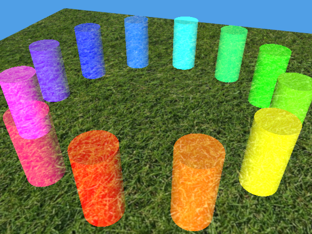
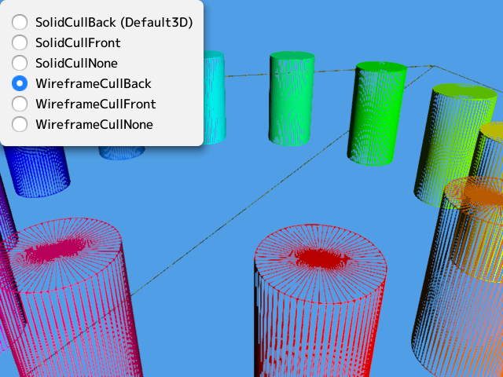
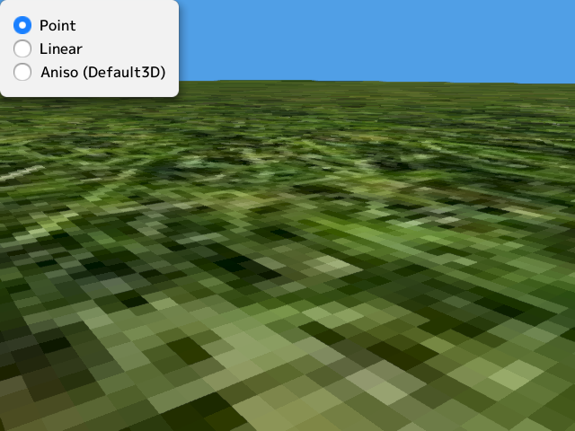
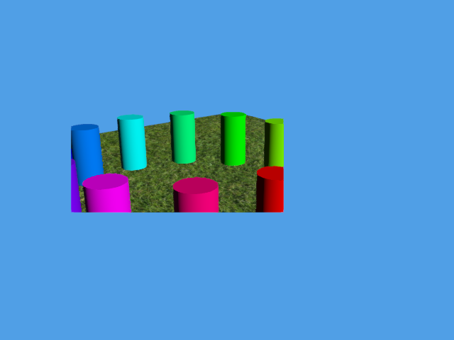

# 29. 3D のレンダーステート

## ブレンドステート
  
ブレンドステートは Forward Rendering のみ有効です。  
```cpp
# include <Siv3D.hpp>

void Main()
{
	Graphics::SetBackground(Color(80, 160, 230));

	const Texture textureGrass(L"Example/Grass.jpg", TextureDesc::For3D);

	Graphics3D::SetAmbientLightForward(ColorF(0.4, 0.4, 0.4));

	Graphics3D::SetBlendStateForward(BlendState::Additive);

	while (System::Update())
	{
		Graphics3D::FreeCamera();

		Plane(40).draw(textureGrass);

		for (int32 i = 0; i < 12; ++i)
		{
			const Vec2 v = Circular(8, Radians(i * 30));

			Cylinder(Vec3(v.x, 2, v.y), 1, 4).drawForward(HSV(i * 30));
		}
	}
}
```

## ラスタライザーステート
  
```cpp
# include <Siv3D.hpp>

void Main()
{
	Graphics::SetBackground(Color(80, 160, 230));

	const Texture textureGrass(L"Example/Grass.jpg", TextureDesc::For3D);

	GUI gui(GUIStyle::Default);
	gui.add(L"method", GUIRadioButton::Create(
	{ L"SolidCullBack (Default3D)", L"SolidCullFront", L"SolidCullNone",
		L"WireframeCullBack", L"WireframeCullFront", L"WireframeCullNone" }, 0u));

	while (System::Update())
	{
		Graphics3D::FreeCamera();

		switch (gui.radioButton(L"method").checkedItem.value())
		{
		case 0:
			Graphics3D::SetRasterizerState(RasterizerState::SolidCullBack);
			break;
		case 1:
			Graphics3D::SetRasterizerState(RasterizerState::SolidCullFront);
			break;
		case 2:
			Graphics3D::SetRasterizerState(RasterizerState::SolidCullNone);
			break;
		case 3:
			Graphics3D::SetRasterizerState(RasterizerState::WireframeCullBack);
			break;
		case 4:
			Graphics3D::SetRasterizerState(RasterizerState::WireframeCullFront);
			break;
		case 5:
			Graphics3D::SetRasterizerState(RasterizerState::WireframeCullNone);
			break;
		}

		Plane(40).draw(textureGrass);

		for (int32 i = 0; i < 12; ++i)
		{
			const Vec2 v = Circular(8, Radians(i * 30));

			Cylinder(Vec3(v.x, 2, v.y), 1, 4).draw(HSV(i * 30));
		}
	}
}
```

## デプスステート
  
```cpp
# include <Siv3D.hpp>

void Main()
{
	Graphics::SetBackground(Color(80, 160, 230));

	const Texture textureGrass(L"Example/Grass.jpg", TextureDesc::For3D);

	GUI gui(GUIStyle::Default);
	gui.add(L"method", GUIRadioButton::Create(
	{ L"TestWrite (Default3D)", L"TestOnly", L"None" }, 0u));

	while (System::Update())
	{
		Graphics3D::FreeCamera();

		switch (gui.radioButton(L"method").checkedItem.value())
		{
		case 0:
			Graphics3D::SetDepthStateForward(DepthState::Default3D);
			break;
		case 1:
			Graphics3D::SetDepthStateForward(DepthState::TestOnly);
			break;
		case 2:
			Graphics3D::SetDepthStateForward(DepthState::None);
			break;
		}

		Plane(40).draw(textureGrass);

		Sphere(Vec3(0, 2, 0), 2).draw();

		for (int32 i = 0; i < 12; ++i)
		{
			const Vec2 v = Circular(8, Radians(i * 30));

			Cylinder(Vec3(v.x, 2, v.y), 1, 4).drawForward(HSV(i * 30).toColorF(0.5));
		}
	}
}
```

## サンプラーステート
  
3D 描画のデフォルトは `WrapAniso` です。
```cpp
# include <Siv3D.hpp>

void Main()
{
	Graphics::SetBackground(Color(80, 160, 230));

	const Texture textureGrass(L"Example/Grass.jpg", TextureDesc::For3D);

	GUI gui(GUIStyle::Default);
	gui.add(L"method", GUIRadioButton::Create(
	{ L"Point", L"Linear", L"Aniso (Default3D)" }, 2u));

	while (System::Update())
	{
		Graphics3D::FreeCamera();

		Plane(40).draw(textureGrass);

		switch (gui.radioButton(L"method").checkedItem.value())
		{
		case 0:
			Graphics3D::SetSamplerState(SamplerState::WrapPoint);
			break;
		case 1:
			Graphics3D::SetSamplerState(SamplerState::WrapLinear);
			break;
		case 2:
			Graphics3D::SetSamplerState(SamplerState::WrapAniso);
			break;
		}
	}
}
```

## シザー矩形
  
```cpp
# include <Siv3D.hpp>

void Main()
{
	Graphics::SetBackground(Color(80, 160, 230));

	const Texture textureGrass(L"Example/Grass.jpg", TextureDesc::For3D);

	RasterizerState rasterizer = RasterizerState::Default3D;
	rasterizer.scissorEnable = true;

	Graphics3D::SetRasterizerState(rasterizer);
	Graphics3D::SetScissorRect(Rect(100, 100, 300, 200));

	while (System::Update())
	{
		Graphics3D::FreeCamera();

		Plane(40).draw(textureGrass);

		for (int32 i = 0; i < 12; ++i)
		{
			const Vec2 v = Circular(8, Radians(i * 30));

			Cylinder(Vec3(v.x, 2, v.y), 1, 4).draw(HSV(i * 30));
		}
	}
}
```

[← 前の章へ戻る](Graphics2D.md)　|　[- 目次 -](Index.md)　|　[次の章へ進む →](Particle.md)
