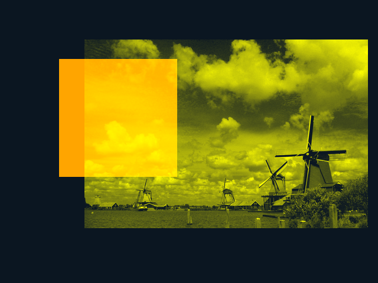
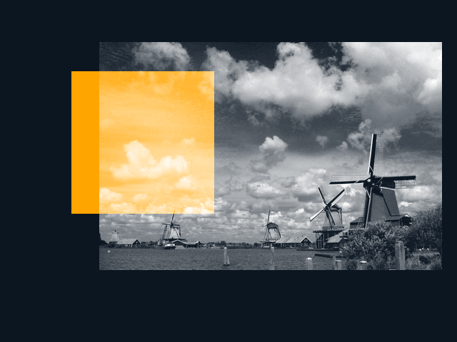
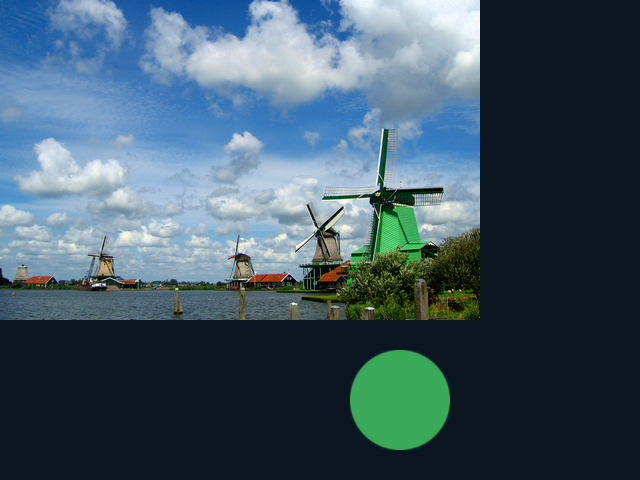
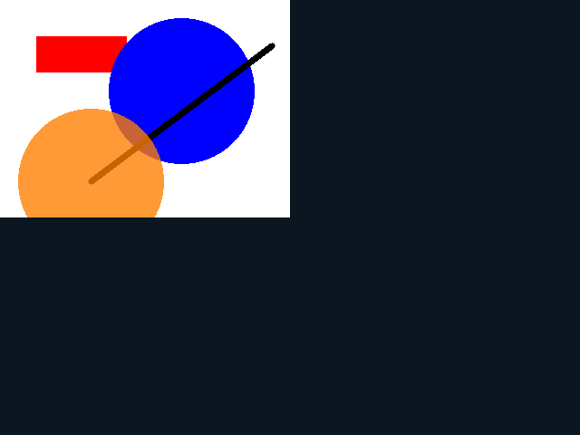
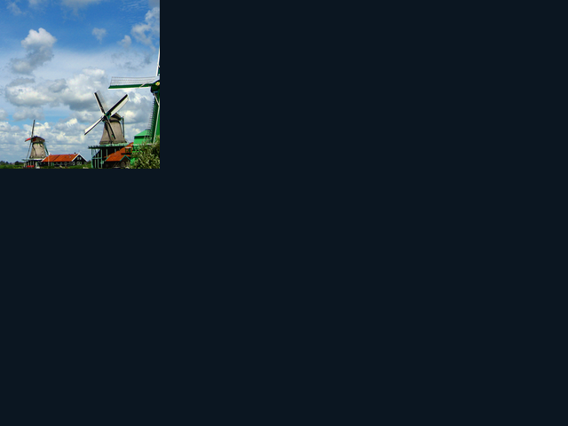
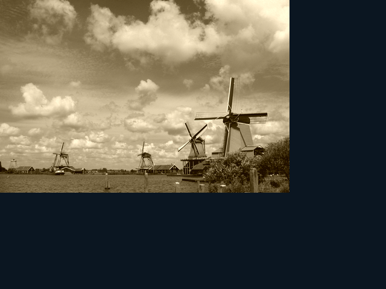
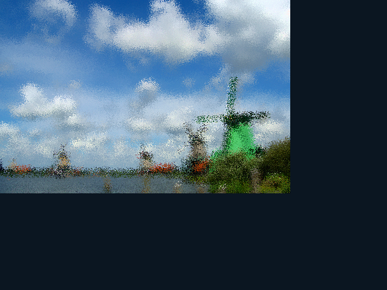
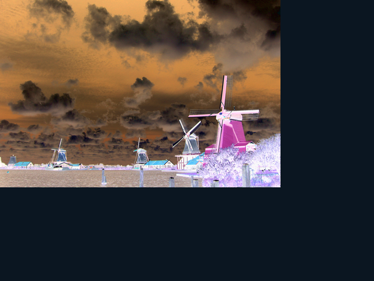
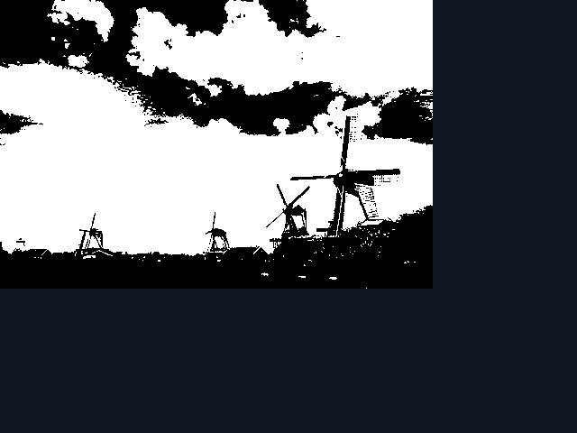

# 21. 画像編集

`Image` クラスは画像データを扱います。`Texture` と異なり、画像を画面に描くことはできませんが、プログラムでピクセルの色を調べたり変更したりできます。  
`Image` の内容を画面に描くには、`Image` から `Texture` を作成します。

## 画像を読み込む
  
```cpp
# include <Siv3D.hpp>

void Main()
{
	const Image image(L"Example/Windmill.png");

	if (!image)
	{
		return;
	}

	Println(L"画像の幅: ", image.width);

	Println(L"画像の高さ: ", image.height);

	WaitKey();
}
```

## 画像を保存する

```cpp
# include <Siv3D.hpp>

void Main()
{
	const Image image(L"Example/Windmill.png");

	// PNG
	image.save(L"images/Windmill.png");

	// JPEG
	image.save(L"images/Windmill.jpg");

	// BMP
	image.save(L"images/Windmill.bmp");

	// GIF
	image.save(L"images/Windmill.gif");

	// TIFF
	image.save(L"images/Windmill.tif");

	// JPEG 2000
	image.save(L"images/Windmill.jp2");

	// DDS
	image.save(L"images/Windmill.dds");

	// WebP
	image.save(L"images/Windmill.webp");

	// TGA
	image.save(L"images/Windmill.tga");

	// PPM
	image.save(L"images/Windmill.ppm");
}
```

## 画像からテクスチャを作成する
  
```cpp
# include <Siv3D.hpp>

void Main()
{
	const Image image(L"Example/Windmill.png");

	const Texture texture(image);

	while (System::Update())
	{
		texture.draw();
	}
}
```

## 指定したサイズの画像を作る
  
```cpp
# include <Siv3D.hpp>

void Main()
{
	// 幅 320, 高さ 240, 塗りつぶしの色 (20, 50, 200)
	const Image image(320, 240, Color(20, 50, 200));

	const Texture texture(image);

	while (System::Update())
	{
		texture.draw();
	}
}
```

## 透過情報を持つ画像を作成する 1
  
```cpp
# include <Siv3D.hpp>

void Main()
{
	Image(480, 320, Palette::Yellow).save(L"Tutorial-RGB.png");

	// 第 2 引数の画像の r 成分を、新しく作る画像の a 成分とする
	const Image image(L"Tutorial-RGB.png", L"Example/Windmill.png");

	const Texture texture(image);

	while (System::Update())
	{
		Rect(100, 100, 200, 200).draw(Palette::Orange);

		texture.draw(Mouse::Pos());
	}
}
```

## 透過情報を持つ画像を作成する 2
  
```cpp
# include <Siv3D.hpp>

void Main()
{
	// 第 2 引数の画像の r 成分を、新しく作る画像の a 成分とする
	const Image image(Palette::White, L"Example/Windmill.png");

	const Texture texture(image);

	while (System::Update())
	{
		Rect(100, 100, 200, 200).draw(Palette::Orange);

		texture.draw(Mouse::Pos());
	}
}
```

## 画像のピクセルの色を取得する
  
```cpp
# include <Siv3D.hpp>

void Main()
{
	const Image image(L"Example/Windmill.png");

	const Texture texture(image);

	while (System::Update())
	{
		texture.draw();

		const Point pos = Mouse::Pos();

		if (0 <= pos.x && pos.x < image.width
			&& 0 <= pos.y && pos.y < image.height)
		{
			// カーソルがさしている位置の色を取得
			const Color pixelColor = image[pos.y][pos.x];

			Circle(400, 400, 50).draw(pixelColor);
		}
	}
}
```

## 画像のピクセルに色を書き込む
  
```cpp
# include <Siv3D.hpp>

void Main()
{
	Image image(320, 240, Palette::White);

	for (int32 y = 0; y < image.height; ++y)
	{
		for (int32 x = 0; x < image.width; ++x)
		{
			image[y][x] = Color(y, x / 2, 200);
		}
	}

	const Texture texture(image);

	while (System::Update())
	{
		texture.draw();
	}
}
```

## 画像に図形を書き込む
  
```cpp
# include <Siv3D.hpp>

void Main()
{
	Image image(320, 240, Palette::White);

	Rect(40, 40, 100, 40).overwrite(image, Palette::Red);

	Circle(200, 100, 80).overwrite(image, Palette::Blue);

	Line({ 100, 200 }, { 300, 50 }).overwrite(image, 5, Palette::Black);

	// 透過して色をブレンドする場合は write()
	Circle(100, 200, 80).write(image, Color(255, 127, 0, 200));

	const Texture texture(image);

	while (System::Update())
	{
		texture.draw();
	}
}
```

## 画像の一部を切り抜く
  
```cpp
# include <Siv3D.hpp>

void Main()
{
	// 画像内の位置 (200, 100) から 幅 180, 高さ 190 の領域を切り抜いた Image から Texture を作成
	const Texture texture(Image(L"Example/Windmill.png").clip(200, 100, 180, 190));

	while (System::Update())
	{
		texture.draw();
	}
}
```

## 近い色の領域を塗りつぶす
  
```cpp
# include <Siv3D.hpp>

void Main()
{
	const Texture texture(
		Image(L"Example/Windmill.png")
		.floodFilled({ 30, 30 }, Palette::Yellow, FloodFillConnectivity::Value8, 50, 50));

	while (System::Update())
	{
		texture.draw();
	}
}
```

## モザイクをかける
  
```cpp
# include <Siv3D.hpp>

void Main()
{
	const Texture texture(Image(L"Example/Windmill.png").mosaiced(10, 10));

	while (System::Update())
	{
		texture.draw();
	}
}
```

## グレイスケールにする
  
```cpp
# include <Siv3D.hpp>

void Main()
{
	const Texture texture(Image(L"Example/Windmill.png").grayscaled());

	while (System::Update())
	{
		texture.draw();
	}
}
```

## セピア調にする
  
```cpp
# include <Siv3D.hpp>

void Main()
{
	const Texture texture(Image(L"Example/Windmill.png").sepiaed());

	while (System::Update())
	{
		texture.draw();
	}
}
```

## ガウスぼかしをかける
  
```cpp
# include <Siv3D.hpp>

void Main()
{
	const Texture texture(Image(L"Example/Windmill.png").gaussianBlurred(15, 15));

	while (System::Update())
	{
		texture.draw();
	}
}
```

## 拡散させる
  
```cpp
# include <Siv3D.hpp>

void Main()
{
	const Texture texture(Image(L"Example/Windmill.png").spreaded(5, 5));

	while (System::Update())
	{
		texture.draw();
	}
}
```

## ネガポジ反転させる
  
```cpp
# include <Siv3D.hpp>

void Main()
{
	const Texture texture(Image(L"Example/Windmill.png").negated());

	while (System::Update())
	{
		texture.draw();
	}
}
```

## 二値化する
  
```cpp
# include <Siv3D.hpp>

void Main()
{
	const Texture texture(Image(L"Example/Windmill.png").thresholded(127));

	while (System::Update())
	{
		texture.draw();
	}
}
```

## 画像を塗りつぶす
  
```cpp
# include <Siv3D.hpp>

void Main()
{
	Image image(L"Example/Windmill.png");

	image.fill(Palette::Orange);

	const Texture texture(image);

	while (System::Update())
	{
		texture.draw();
	}
}
```

## 拡大縮小した画像を作成する
  
```cpp
# include <Siv3D.hpp>

void Main()
{
	const Image image(L"Example/Windmill.png");

	const Texture texture(image.scaled(400, 400));

	const Texture texture2(image.scaled(0.5));

	while (System::Update())
	{
		texture.draw();

		texture2.draw();
	}
}
```

[← 前の章へ戻る](Asset.md)　|　[- 目次 -](Index.md)　|　[次の章へ進む →](Webcam.md)