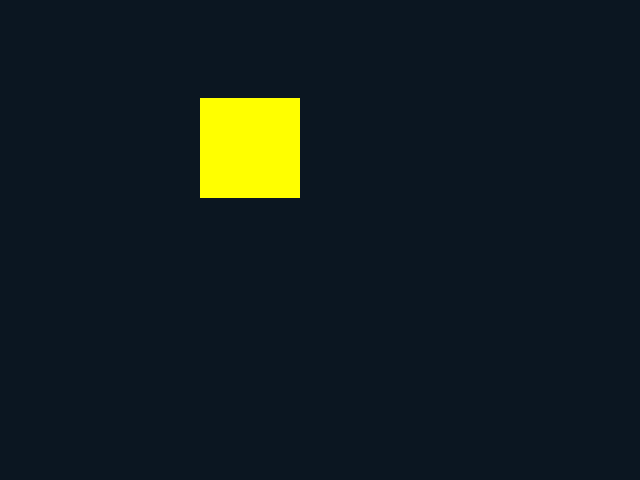
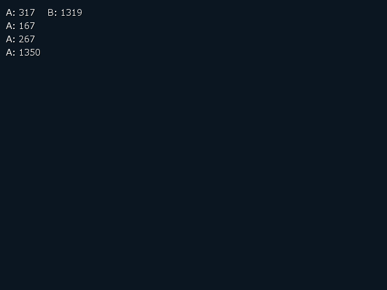
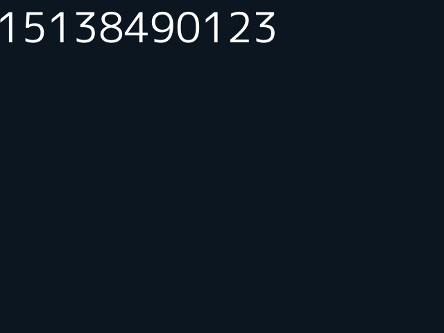
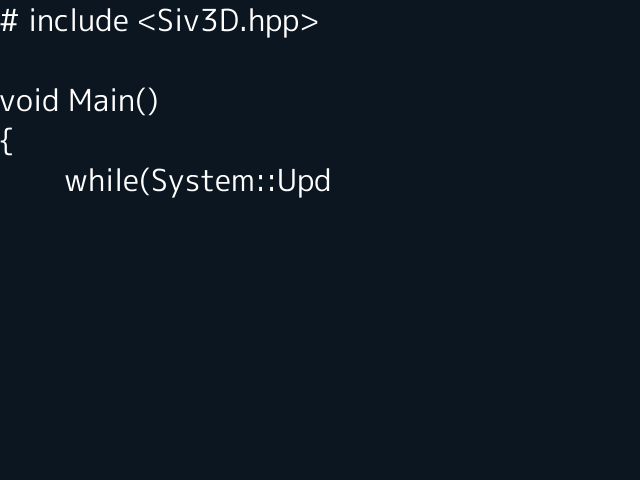

# 6. キーボード入力

## キーがクリックされた
  
```cpp
# include <Siv3D.hpp>

void Main()
{
	const Font font(40);

	int32 count = 0;

	while (System::Update())
	{
		// [S] キーがクリックされたら
		if (Input::KeyS.clicked)
		{
			++count;
		}

		// [0] キーがクリックされたら
		if (Input::Key0.clicked)
		{
			count = 0;
		}

		font(count, L'回').draw();
	}
}
```

## キーが押されている
  
```cpp
# include <Siv3D.hpp>

void Main()
{
	Point pos(200, 200);

	while (System::Update())
	{
		// [→] キーが押されていたら
		if (Input::KeyRight.pressed)
		{
			++pos.x;
		}

		// [←] キーが押されていたら
		if (Input::KeyLeft.pressed)
		{
			--pos.x;
		}

		// [↓] キーが押されていたら
		if (Input::KeyDown.pressed)
		{
			++pos.y;
		}

		// [↑] キーが押されていたら
		if (Input::KeyUp.pressed)
		{
			--pos.y;
		}

		// 黄色い四角が移動する
		Rect(pos, 100, 100).draw(Palette::Yellow);
	}
}
```

## キーが離された
  
```cpp
# include <Siv3D.hpp>

void Main()
{
	const Font font(40);

	int32 count = 0;

	while (System::Update())
	{
		// [スペース] キーが離された
		if (Input::KeySpace.released)
		{
			++count;
		}

		font(count, L'回').draw();
	}
}
```

## キーが押されてからの経過時間
  
```cpp
# include <Siv3D.hpp>

void Main()
{
	while (System::Update())
	{
		if (Input::KeyA.released)
		{
			Println(L"A: ", Input::KeyA.pressedDuration);
		}

		PutText(L"B: ", Input::KeyB.pressedDuration).from(80, 10);
	}
}
```

## 2 つのキーを組み合わせる
  
```cpp
# include <Siv3D.hpp>

void Main()
{
	const Font font(40);

	int32 count = 0;

	while (System::Update())
	{
		// [Ctrl] キーが押されている状態で、 [I] キーがクリックされたら
		if ((Input::KeyControl + Input::KeyI).clicked)
		{
			++count;
		}

		// [Shift] キーが押されている状態で、 [;] キーが押されていたら
		if ((Input::KeyShift + Input::KeySemicolon).pressed)
		{
			++count;
		}

		// [0] キーまたは [C] キーがクリックされたら
		if ((Input::Key0 | Input::KeyC).clicked)
		{
			count = 0;
		}

		font(count, L'回').draw();
	}
}
```

## 複数のキー入力の組み合わせ
  
```cpp
# include <Siv3D.hpp>

void Main()
{
	const auto ok = Input::KeyZ
		| Input::KeySpace
		| Input::KeyEnter
		| (Input::KeyControl + Input::KeyC);

	while (System::Update())
	{
		if (ok.pressed)
		{
			Circle(100, 100, 100).draw();
		}
	}
}
```

## キーを文字で指定する
  
```cpp
# include <Siv3D.hpp>

void Main()
{
	const Font font(40);

	String text;

	while (System::Update())
	{
		for (wchar ch = L'0'; ch <= L'9'; ++ch)
		{
			// 指定した文字のキーがクリックされたら
			if (Key(ch).clicked)
			{
				// その文字をテキストに追加
				text += ch;
			}
		}

		if (Key(L'C').clicked)
		{
			// テキストを消去
			text.clear();
		}

		font(text).draw();
	}
}
```

## テキストの入力
  
```cpp
# include <Siv3D.hpp>

void Main()
{
	const Font font(20);

	// 空の String
	String text;

	while (System::Update())
	{
		// text を入力された文字列で更新する
		// バックスペースやタブ、改行も有効
		Input::GetCharsHelper(text);

		font(text).draw();
	}
}
```

## なんらかのキーがクリックされた
  
```cpp
# include <Siv3D.hpp>

void Main()
{
	const Font font(40);

	int32 count = 0;

	while (System::Update())
	{
		// 何らかのキーがクリックされたら
		if (Input::AnyKeyClicked())
		{
			++count;
		}

		font(count, L'回').draw();
	}
}
```

## 入力されたキーの一覧を取得する
  
```cpp
# include <Siv3D.hpp>

void Main()
{
	const Font font(30);

	while (System::Update())
	{
		int32 i = 0;

		for (const auto& key : Input::GetActiveKeys())
		{
			font(key.code).draw(20, i * 40);

			++i;
		}
	}
}
```

[← 前の章へ戻る](Formatting.md)　|　[- 目次 -](Index.md)　|　[次の章へ進む →](Mouse.md)