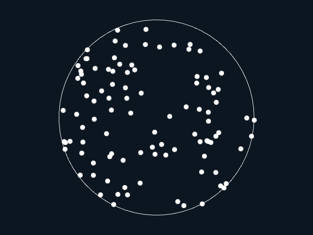

# 12. 乱数

## 0.0 から 1.0 の乱数
  
```cpp
# include <Siv3D.hpp>

void Main()
{
	for (int32 i = 0; i < 10; ++i)
	{
		Println(Random());
	}

	WaitKey();
}
```

## 型と範囲を指定した乱数 (int)
")  
```cpp
# include <Siv3D.hpp>

void Main()
{
	for (int32 i = 0; i < 10; ++i)
	{
		Println(Random(1, 6));
	}

	WaitKey();
}
```

## 型と範囲を指定した乱数 (double)
")  
```cpp
# include <Siv3D.hpp>

void Main()
{
	for (int32 i = 0; i < 10; ++i)
	{
		Println(Random(-100.0, 100.0));
	}

	WaitKey();
}
```

## 型と範囲を指定した乱数 (wchar)
")  
```cpp
# include <Siv3D.hpp>

void Main()
{
	for (int32 i = 0; i < 10; ++i)
	{
		Println(Random(L'A', L'Z'));
	}

	WaitKey();
}
```

## 乱数のシード
  
```cpp
# include <Siv3D.hpp>

void Main()
{
	// 乱数シードを 12345 に設定
	Reseed(12345);

	for (int32 i = 0; i < 10; ++i)
	{
		Println(Random(1, 6));
	}

	WaitKey();
}
```

## 乱数生成エンジン
  
```cpp
# include <Siv3D.hpp>

void Main()
{
	// 乱数生成エンジンをシード 12345 で初期化
	RNG rng(12345);

	// 型と範囲を決める分布クラス
	UniformDistribution<int32> dist(1, 6);

	for (int32 i = 0; i < 10; ++i)
	{
		Println(dist(rng));
	}

	WaitKey();
}
```

## 乱数 (bool)
")  
```cpp
# include <Siv3D.hpp>

void Main()
{
	for (int32 i = 0; i < 10; ++i)
	{
		// 33% の確率で true
		Println(RandomBool(0.33));
	}

	WaitKey();
}
```

## ランダムに選択する 1
  
```cpp
# include <Siv3D.hpp>

void Main()
{
	for (int32 i = 0; i < 10; ++i)
	{
		// リストからランダムに選択
		Println(RandomSelect({ 0, 100, 200, 500, 1000 }));
	}

	WaitKey();
}
```

## ランダムに選択する 2
  
```cpp
# include <Siv3D.hpp>

void Main()
{
	while (System::Update())
	{
		if (Input::MouseL.clicked)
		{
			const Color color = RandomSelect<Color>(
			{ { 255, 128, 128 },{ 128, 255, 128 },{ 128, 128, 255 }});

			Graphics::SetBackground(color);
		}
	}
}
```

## ランダムな座標
  
```cpp
# include <Siv3D.hpp>

void Main()
{
	Array<Vec2> points;

	for (int32 i = 0; i < 100; ++i)
	{
		points.push_back(RandomVec2({ 0, 320 }, { 0, 240 }));
	}

	while (System::Update())
	{
		for (const auto& point : points)
		{
			Circle(point, 5).draw();
		}
	}
}
```

## 円の内部のランダムな座標
  
```cpp
# include <Siv3D.hpp>

void Main()
{
	const Circle circle(320, 240, 200);

	Array<Vec2> points;

	for (int32 i = 0; i < 100; ++i)
	{
		points.push_back(RandomVec2(circle));
	}

	while (System::Update())
	{
		for (const auto& point : points)
		{
			Circle(point, 5).draw();
		}

		circle.drawFrame();
	}
}
```

## ランダムな色
  
```cpp
# include <Siv3D.hpp>

void Main()
{
	Array<Color> colors;

	for (int32 i = 0; i < 100; ++i)
	{
		colors.push_back(RandomColor());
	}

	while (System::Update())
	{
		for (int32 y = 0; y < 10; ++y)
		{
			for (int32 x = 0; x < 10; ++x)
			{
				Rect(x * 40, y * 40, 40, 40).draw(colors[y * 10 + x]);
			}
		}
	}
}
```

## 配列の要素をシャッフルする
  
```cpp
# include <Siv3D.hpp>

void Main()
{
	Array<int32> values = { 1,2,3,4,5 };

	Shuffle(values);

	Println(values);

	WaitKey();
}
```

[← 前の章へ戻る](Geometry2D.md)　|　[- 目次 -](Index.md)　|　[次の章へ進む →](Dialog.md)