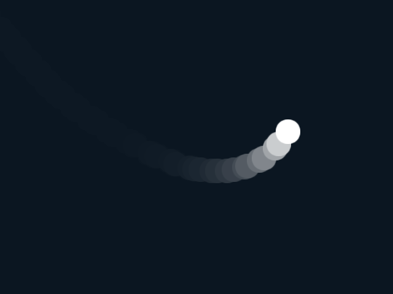
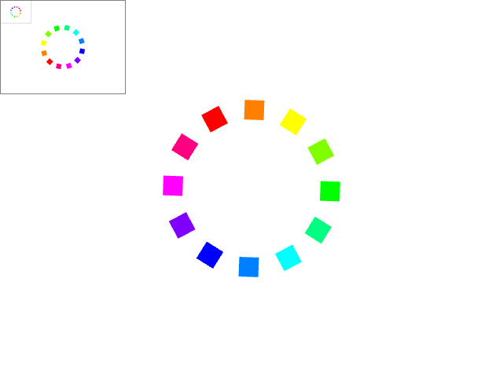

# 31. スクリーンショット

## PrintScreen キーでスクリーンショットを保存する
  
PrintScreen キーを押すと自動でスクリーンショットが保存されます。  
保存先は実行ファイルのディレクトリの Screenshot フォルダです。  
この機能をオフにしたい場合は `ScreenCapture::EnableScreenshot(false)` を呼びます。

## Ctrl + PrintScreen キーでプレイムービーをキャプチャする
Ctrl + PrintScreen キーを押すと自動でプレイムービーの録画が開始します。  
録画はアプリが終了するか、もう一度 Ctrl + PrintScreen キーが押されるまで続きます。  
保存先は実行ファイルのディレクトリの Screenshot フォルダです。  
この機能をオフにしたい場合は `ScreenCapture::EnableVideoCapture(false)` を呼びます。

## 直前のフレームを Texture として使う
  
```cpp
# include <Siv3D.hpp>

void Main()
{
	while (System::Update())
	{
		Graphics::GetSwapChainTexture().draw(Alpha(200));

		Circle(Mouse::Pos(), 20).draw();
	}
}
```

## 直前のフレームを Image として取得する
  
スクリーンショットを Image として取得したい場合は、直前のフレームで `ScreenCapture::Request()` を呼び、次のフレームで `ScreenCapture::GetFrame()` を通して Image を受け取ります。
```cpp
# include <Siv3D.hpp>

void Main()
{
	Graphics::SetBackground(Palette::White);

	DynamicTexture texture;

	Image image;

	while (System::Update())
	{
		for (int32 i = 0; i < 12; ++i)
		{
			const double radian = Radians(i * 30 + System::FrameCount());

			const Vec2 pos = Circular(100, radian) + Window::Center();

			RectF(25).setCenter(pos).rotated(radian).draw(HSV(i * 30));
		}

		if (texture)
		{
			texture.draw();

			Rect(0, 0, texture.size).drawFrame(1, 0, Palette::Gray);
		}

		if (ScreenCapture::HasNewFrame())
		{
			ScreenCapture::GetFrame(image);

			texture.fill(image.scaled(0.25));
		}

		if (Input::MouseL.clicked)
		{
			ScreenCapture::Request();
		}
	}
}
```

[← 前の章へ戻る](Particle.md)　|　[- 目次 -](Index.md)　|　[次の章へ進む →](Release.md)