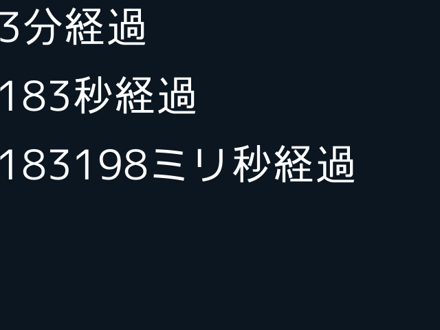
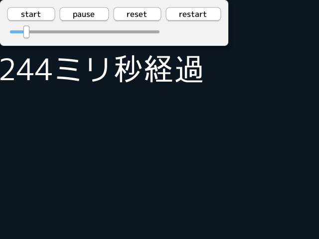
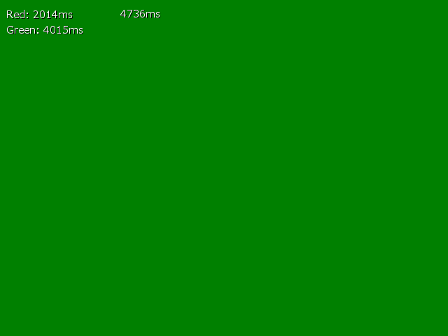

# 24. 経過時間の測定

## ストップウォッチ
  
```cpp
# include <Siv3D.hpp>

void Main()
{
	const Font font(40);

	Stopwatch stopwatch;

	// ストップウォッチをスタート
	stopwatch.start();

	while (System::Update())
	{
		font(stopwatch.min(), L"分経過").draw(0, 0);

		font(stopwatch.s(), L"秒経過").draw(0, 100);

		font(stopwatch.ms(), L"ミリ秒経過").draw(0, 200);
	}
}
```

## ストップウォッチを初期化と同時にスタート
  
```cpp
# include <Siv3D.hpp>

void Main()
{
	const Font font(40);

	// ストップウォッチをスタート
	Stopwatch stopwatch(true);

	while (System::Update())
	{
		font(stopwatch.min(), L"分経過").draw(0, 0);

		font(stopwatch.s(), L"秒経過").draw(0, 100);

		font(stopwatch.ms(), L"ミリ秒経過").draw(0, 200);
	}
}
```

## ストップウォッチの操作
  
```cpp
# include <Siv3D.hpp>

void Main()
{
	const Font font(40);

	GUI gui(GUIStyle::Default);
	gui.add(L"start", GUIButton::Create(L"start"));
	gui.add(L"pause", GUIButton::Create(L"pause"));
	gui.add(L"reset", GUIButton::Create(L"reset"));
	gui.add(L"restart", GUIButton::Create(L"restart"));

	Stopwatch stopwatch;

	while (System::Update())
	{
		if (gui.button(L"start").pushed)
		{
			stopwatch.start();
		}

		if (gui.button(L"pause").pushed)
		{
			stopwatch.pause();
		}

		if (gui.button(L"reset").pushed)
		{
			stopwatch.reset();
		}

		if (gui.button(L"restart").pushed)
		{
			stopwatch.restart();
		}

		font(stopwatch.ms(), L"ミリ秒経過").draw(0, 100);
	}
}
```

## スピードを変えられるストップウォッチ
  
```cpp
# include <Siv3D.hpp>

void Main()
{
	const Font font(40);

	GUI gui(GUIStyle::Default);
	gui.add(L"start", GUIButton::Create(L"start"));
	gui.add(L"pause", GUIButton::Create(L"pause"));
	gui.add(L"reset", GUIButton::Create(L"reset"));
	gui.addln(L"restart", GUIButton::Create(L"restart"));
	gui.add(L"speed", GUISlider::Create(0.0, 2.0, 1.0, 300));

	VariableSpeedStopwatch stopwatch;

	while (System::Update())
	{
		stopwatch.setSpeed(gui.slider(L"speed").value);

		if (gui.button(L"start").pushed)
		{
			stopwatch.start();
		}

		if (gui.button(L"pause").pushed)
		{
			stopwatch.pause();
		}

		if (gui.button(L"reset").pushed)
		{
			stopwatch.reset();
		}

		if (gui.button(L"restart").pushed)
		{
			stopwatch.restart();
		}

		font(stopwatch.ms(), L"ミリ秒経過").draw(0, 100);
	}
}
```

## イベントタイマー
  
`EventTimer` はある時間の通過を調べられる `Stopwatch` です。
イベントを `EventTimer::addEvent()` で設定し、あるイベントの時間を通過したかどうかは `EventTimer::onTriggered()` で判定します。  
`EventTimer::clearEvents()` を呼ばない限り、設定したイベント情報は消えないので、`EventTimer::restart()` で何回でもイベントを発生させることができます。  
`Stopwatch` と異なり、イベント通過判定のために毎フレーム `EventTimer::update()` を呼ぶ必要があることに注意してください。  
```cpp
# include <Siv3D.hpp>

void Main()
{
	Graphics::SetBackground(Palette::Gray);

	EventTimer eventTimer;
	eventTimer.addEvent(L"Red", 2.0s);
	eventTimer.addEvent(L"Blue", 6.0s);
	eventTimer.addEvent(L"Green", 4.0s);
	eventTimer.start();

	while (System::Update())
	{
		const auto elapsed = eventTimer.update();

		PutText(elapsed).at(200, 20);

		if (eventTimer.onTriggered(L"Red"))
		{
			Println(L"Red: ", elapsed);
			Graphics::SetBackground(Palette::Red);
		}
		
		if (eventTimer.onTriggered(L"Green"))
		{
			Println(L"Green: ", elapsed);
			Graphics::SetBackground(Palette::Green);
		}
		
		if (eventTimer.onTriggered(L"Blue"))
		{
			Println(L"Blue: ", elapsed);
			Graphics::SetBackground(Palette::Blue);
		}

		if (Input::MouseR.clicked)
		{
			Println(L"restart");
			Graphics::SetBackground(Palette::Gray);
			eventTimer.restart();
		}
	}
}
```

[← 前の章へ戻る](Recorder.md)　|　[- 目次 -](Index.md)　|　[次の章へ進む →](HSV.md)