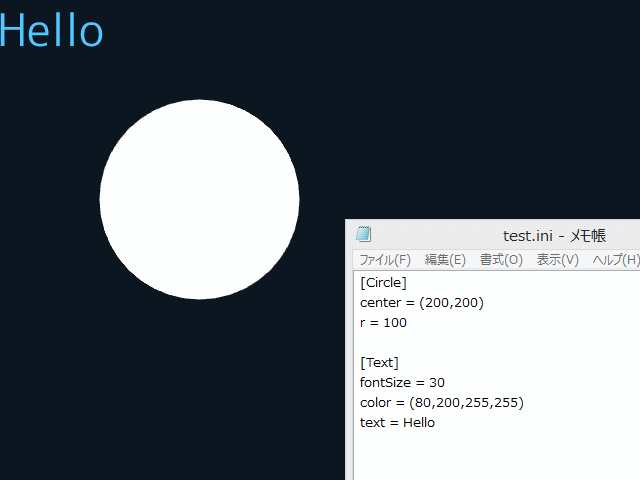

# 17. INI, CSV, JSON

## INI ファイルを作成してデータを書き込む

```cpp
# include <Siv3D.hpp>

void Main()
{
	INIWriter ini(L"Tutorial-INI.ini");

	ini.write(L"Circle", L"center", Vec2(200, 200));
	ini.write(L"Circle", L"r", 100.0);

	ini.write(L"Text", L"fontSize", 30);
	ini.write(L"Text", L"text", L"Hello");
	ini.write(L"Text", L"color", Color(80, 200, 255));
}
```
作成される Tutorial-INI.ini
> [Circle]  
> center = (200,200)  
> r = 100  
>  
> [Text]  
> fontSize = 30  
> color = (80,200,255,255)  
> text = Hello

## INI ファイルからデータを読み込む

```cpp
# include <Siv3D.hpp>

void Main()
{
	// 書き込みのサンプルで作成した INI ファイル
	INIReader ini(L"Tutorial-INI.ini");

	if (!ini)
	{
		return;
	}

	Circle circle;
	circle.center = ini.get<Vec2>(L"Circle.center");
	circle.r = ini.get<double>(L"Circle.r");

	// getOr は読み込みに失敗した場合、第 2 引数の値を返す
	Font font(ini.getOr<int32>(L"Text.fontSize", 20));
	String text = ini.get<String>(L"Text.text");
	Color color = ini.getOr<Color>(L"Text.color", Color(255));

	while (System::Update())
	{
		circle.draw();

		font(text).draw(0, 0, color);
	}
}
```

## INI ファイルの更新を検知する
  
```cpp
# include <Siv3D.hpp>

void Main()
{
	// 書き込みのサンプルで作成した INI ファイル
	INIReader ini(L"Tutorial-INI.ini");

	if (!ini)
	{
		return;
	}

	Circle circle;
	circle.center = ini.get<Vec2>(L"Circle.center");
	circle.r = ini.get<double>(L"Circle.r");

	Font font(ini.getOr<int>(L"Text.fontSize", 20));
	String text = ini.get<String>(L"Text.text");
	Color color = ini.getOr<Color>(L"Text.color", Color(255));

	while (System::Update())
	{
		// ファイルの変更を検知
		if (ini.hasChanged())
		{
			// データを更新
			ini.reload();

			circle.center = ini.get<Vec2>(L"Circle.center");
			circle.r = ini.get<double>(L"Circle.r");

			font = Font(ini.getOr<int32>(L"Text.fontSize", 20));
			text = ini.get<String>(L"Text.text");
			color = ini.getOr<Color>(L"Text.color", Color(255));
		}

		circle.draw();

		font(text).draw(0, 0, color);
	}
}
```

## CSV ファイルを作成してデータを書き出す

```cpp
# include <Siv3D.hpp>

void Main()
{
	CSVWriter writer(L"Tutorial-CSV.csv");

	writer.write(10);

	writer.write(50);

	writer.write(L"abc");

	writer.nextLine();

	writer.writeRow(20, 100, L"def", L"ghi");
}
```
作成される Tutorial-CSV.csv
> "10","50","abc"  
> "20","100","def","ghi"  

## CSV ファイルからデータを読み込む

```cpp
# include <Siv3D.hpp>

void Main()
{
	const CSVReader csv(L"Example/test.csv");

	if (!csv)
	{
		return;
	}

	Println(L"行数: ", csv.rows);

	Println(L"0 行目の列数: ", csv.columns(0));

	Println(L"0 行 0 列の要素: ", csv.get<int32>(0, 0));

	Println(L"0 行 1 列の要素: ", csv.get<double>(0, 1));

	Println(L"1 行 0 列の要素: ", csv.get<String>(1, 0));

	// Optional として取得
	Println(L"1 行 0 列の要素: ", csv.getOpt<int32>(1, 0));

	// 読み込みに失敗したときの値を指定
	Println(L"1 行 0 列の要素: ", csv.getOr<int32>(1, 0, -1));

	WaitKey();
}
```

## CSV ファイルの更新を検知する
  
```cpp
# include <Siv3D.hpp>

void Main()
{
	CSVWriter writer(L"Tutorial-CSV.csv");

	writer.writeRow(L"Siv3D", Point(40, 40), Color(40, 150, 250));

	writer.close();

	const Font font(30);

	CSVReader reader(L"Tutorial-CSV.csv");

	while (System::Update())
	{
		if (reader.hasChanged())
		{
			reader.reload();
		}

		font(reader.getOr<String>(0, 0, String())).draw(reader.getOr<Point>(0, 1, Point(0, 0)), reader.getOr<Color>(0, 2, Color(255)));
	}
}
```

## JSON ファイルからデータを読み込む

```cpp
# include <Siv3D.hpp>

void Main()
{
	const JSONReader json(L"Example/test.json");

	Println(json[L"アジア"][L"日本"][L"面積"].get<int32>());

	Println(json[L"アジア.日本.面積"].get<int32>());

	Println(json[L"アジア.日本.面積"].getOpt<int32>());

	Println(json[L"アジア.日本.面積"].getOr<int32>(-1));

	Println(json[L"アジア.hoge.foo"].getOpt<int32>());

	Println(json[L"アジア.hoge.foo"].getOr<int32>(-1));

	for (const auto& a : json[L"北アメリカ.カナダ.公用語"].getArray())
	{
		Println(a.get<String>());
	}

	for (const auto& o : json[L"アジア"].getObject())
	{
		Println(o.first, L"の首都は", o.second[L"首都"].get<String>());
	}

	WaitKey();
}
```

[← 前の章へ戻る](Text.md)　|　[- 目次 -](Index.md)　|　[次の章へ進む →](Binary.md)