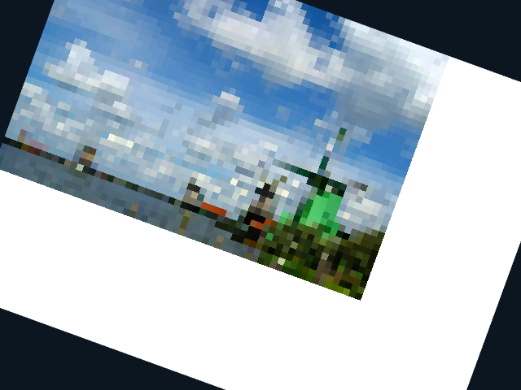
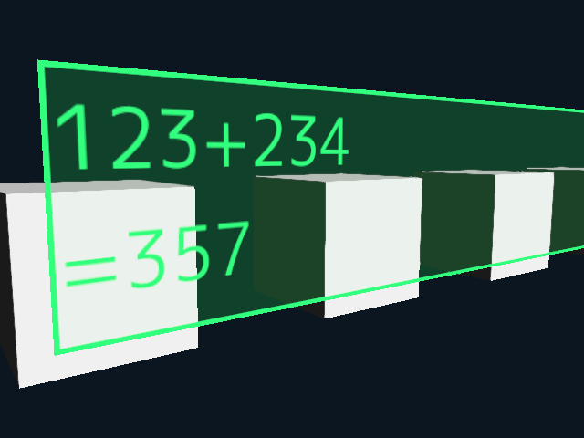
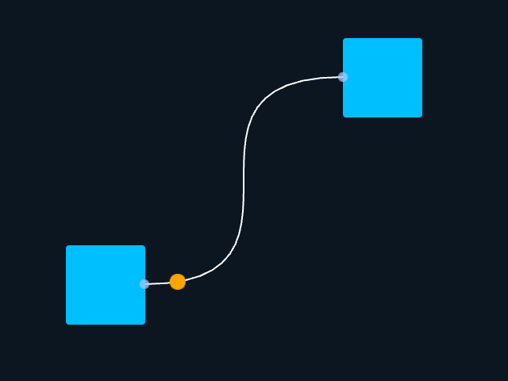
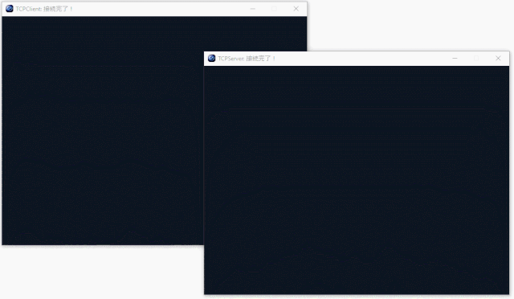

# Siv3D January 2016 おもな新機能サンプル (随時追加予定）

## RenderTexture
### 2D
  
```cpp
# include <Siv3D.hpp>

void Main()
{
	const Texture texture(L"Example/Windmill.png");

	RenderTexture rt(Size(640, 480) / 8, ColorF(1.0));

	Graphics2D::SetRenderTarget(rt);

	texture.scale(1.0 / 8).draw();

	Graphics2D::SetRenderTarget(Graphics::GetSwapChainTexture());

	while (System::Update())
	{
		Graphics2D::SetSamplerState(SamplerState::ClampPoint);

		rt.scale(8).rotate(20_deg).draw();

		Graphics2D::SetSamplerState(SamplerState::Default2D);
	}
}
```

### 3D
  
```cpp
# include <Siv3D.hpp>

void Main()
{
	const Font font(40);
	String expression;

	RenderTexture texture(1000, 200, Color(0, 0), TextureFormat::R8G8B8A8_Snorm);
	const Mesh mesh(MeshData::PlaneXY(10, 2));
	Graphics3D::SetLightForward(0, Light::None());
	Graphics3D::SetAmbientLightForward(ColorF(1.0));

	while (System::Update())
	{
		Graphics3D::FreeCamera();
		Input::GetCharsHelper(expression);

		texture.clear(ColorF(1.0, 0.05));
		Graphics2D::SetRenderTarget(texture);

		BlendState blend = BlendState::Default;
		blend.opAlpha = BlendOp::Max;
		Graphics2D::SetBlendState(blend);

		font(expression).draw(10, 10);

		if (const auto result = EvaluateOpt(expression))
		{
			font(L'=', result.value()).draw(10, 100);
		}

		Rect(texture.size).drawFrame(4);

		Graphics2D::SetRenderTarget(Graphics::GetSwapChainTexture());
		Graphics::Render2D();

		mesh.translated(0, 1, -3).drawForward(texture, ColorF(0.2, 1.0, 0.5));

		for (int32 x = -2; x <= 2; ++x)
		{
			Box(Vec3(x * 4, 0, 0), 2).draw();
		}
	}
}
```

## ZIP の書き出し

```cpp
# include <Siv3D.hpp>

void Main()
{
	ZIPWriter writer(L"Test.zip");
	writer.addFile(L"Test/Test.txt", L"Example/Test.txt");
	writer.addFile(L"Test/YomogiFont.ttf", L"Example/YomogiFont.ttf");
	writer.addFile(L"Test/Windmill.png", L"Example/Windmill.png");
}
```

## 数式処理
 
```cpp
# include <Siv3D.hpp>

void Main()
{
	Graphics::SetBackground(Color(240));

	const Font font(40);

	String expression;

	while (System::Update())
	{
		Input::GetCharsHelper(expression);

		font(expression).draw(10, 10, Palette::Black);

		if (const auto result = EvaluateOpt(expression))
		{
			font(result.value()).draw(10, 250, Palette::Black);
		}
	}
}
```

## MIDI ファイルのノート情報の取得
```cpp
# include <Siv3D.hpp>

void Main()
{
	if (const auto midiFile = Dialog::GetOpenMidi())
	{
		if (!Midi::Open(midiFile.value()))
		{
			return;
		}
	}
	else
	{
		return;
	}

	const auto score = Midi::GetScore();

	TextWriter writer(L"midi.txt");

	int32 channel = 0;

	for (const auto& notes : score)
	{
		writer.writeln(L"----------------------ch: {}----------------------"_fmt, channel++);

		for (const auto& note : notes)
		{
			writer.writeln(L"note: {} start: {} length: {}"_fmt, note.noteNumber, note.startMillisec, note.lengthMillisec);
		}
	}
}
```


## シリアライズ / デシリアライズ

```cpp
# include <Siv3D.hpp>

struct Monster
{
	String name;

	int32 id;

	double size;

	Array<int32> values;

	// このようなメンバ関数を定義する
	template <class Archive>
	void serialize(Archive& archive)
	{
		archive(name, id, size, values);
	}
};

void Main()
{
	const Monster monster = { L"Goblin", 123, 1.2, {10, 20, 30, 40} };
	Serializer<BinaryWriter> writer(L"save.bin");
	writer(monster);
	writer.getWriter().close();

	Deserializer<BinaryReader> reader(L"save.bin");
	Monster m;
	reader(m);

	Println(m.name);
	Println(m.id);
	Println(m.size);
	Println(m.values);

	WaitKey();
}
```

## Shape 型

```cpp
# include <Siv3D.hpp>

void Main()
{
	Array<Shape> shapes;
	shapes.emplace_back(Circle(150, 100, 80));
	shapes.emplace_back(Rect(350, 100, 200, 100));
	shapes.emplace_back(Ellipse(150, 300, 100, 50));
	shapes.emplace_back(Line(300, 300, 400, 350));

	shapes[3] = Geometry2D::CreateStar(100, 0, { 450, 350 });

	Println(shapes[0].type() == Shape::Type::Circle);
	Println(shapes[3].typeName());

	while (System::Update())
	{
		for (const auto& shape : shapes)
		{
			shape.draw(shape.mouseOver ? Palette::Red : Palette::Yellow);
		}
	}
}
```

## ベジェ曲線
  
```cpp
# include <Siv3D.hpp>

void Main()
{
	Window::SetPos(770, 383);

	const double speed = 2.0;
	Rect rectA(100, 100, 100), rectB(300, 200, 100);
	bool grabbedA = false, grabbedB = false;
	CubicBezier bezier(Vec2(100, 400), Vec2(200, 400), Vec2(200, 100), Vec2(300, 100));
	CubicBezierPath path(bezier);

	while (System::Update())
	{
		if (rectA.leftClicked)
		{
			grabbedA = true;
		}
		else if (rectB.leftClicked)
		{
			grabbedB = true;
		}

		if (grabbedA)
		{
			rectA.moveBy(Mouse::Delta());
		}
		else if (grabbedB)
		{
			rectB.moveBy(Mouse::Delta());
		}

		if (Input::MouseL.released)
		{
			grabbedA = grabbedB = false;
		}

		bezier.p0 = (rectA.center.x < rectB.center.x ? (rectA.tr + rectA.br) : (rectA.tl + rectA.bl)) / 2;
		bezier.p3 = (rectB.center.x < rectA.center.x ? (rectB.tr + rectB.br) : (rectB.tl + rectB.bl)) / 2;
		bezier.p1.set(bezier.p3.x, bezier.p0.y);
		bezier.p2.set(bezier.p0.x, bezier.p3.y);
		path.set(bezier);

		double r = path.advance(speed, 40);

		if (r >= 1.0 || IsNaN(r))
		{
			path.set(r = 0.0);
		}

		bezier.draw(2);

		RoundRect(rectA, 4).draw(Palette::Deepskyblue);
		RoundRect(rectB, 4).draw(Palette::Deepskyblue);
		
		Circle(bezier.p0, 6).draw(Color(160, 200, 255, 200));
		Circle(bezier.p3, 6).draw(Color(160, 200, 255, 200));

		Circle(bezier.getPos(r), 10).draw(Palette::Orange);
	}
}
```

## TCP 通信
  
### サーバー
```cpp
# include <Siv3D.hpp>

void Main()
{
	TCPServer server;
	server.startAccept(50000);
	Point friendPos(0, 0);

	Window::SetTitle(L"TCPServer: 接続待機中...");

	while (System::Update())
	{
		if (server.isConnected())
		{
			Window::SetTitle(L"TCPServer: 接続完了！");

			server.send(Mouse::Pos());

			while (server.read(friendPos));
		}

		if (server.hasError())
		{
			server.disconnect();

			Window::SetTitle(L"TCPServer: 再接続待機中...");

			server.startAccept(50000);
		}

		Circle(Mouse::Pos(), 30).draw(Palette::Skyblue);

		Circle(friendPos, 10).draw(Palette::Orange);
	}
}
```
### クライアント
```cpp
# include <Siv3D.hpp>

void Main()
{
	TCPClient client;
	client.connect(IPv4::localhost(), 50000);
	Point friendPos(0, 0);

	Window::SetTitle(L"TCPClient: 接続待機中...");

	while (System::Update())
	{
		if (client.isConnected())
		{
			Window::SetTitle(L"TCPClient: 接続完了！");

			client.send(Mouse::Pos());

			while (client.read(friendPos));
		}

		if (client.hasError())
		{
			client.disconnect();

			Window::SetTitle(L"TCPClient: 再接続待機中...");

			client.connect(IPv4::localhost(), 50000);
		}

		Circle(Mouse::Pos(), 30).draw(Palette::Skyblue);

		Circle(friendPos, 10).draw(Palette::Orange);
	}
}
```

## 手書き文字認識
 
```cpp
# include <Siv3D.hpp>

void Main()
{
    const HandwritingRecognizer recognizer(L"Example/Hiragana.model");
    const Font font(34);

    Image image(400, 400, Palette::White);

    DynamicTexture texture(image);

    Array<Array<Point>> pointsList;

    while (System::Update())
    {
        texture.draw();

        if (Input::MouseL.pressed)
        {
            if (Input::MouseL.clicked)
            {
                pointsList.emplace_back();
            }

            pointsList.back().push_back(Mouse::Pos());

            const Point from = Input::MouseL.clicked ? Mouse::Pos() : Mouse::PreviousPos();

            Line(from, Mouse::Pos()).overwrite(image, 8, Palette::Blue);

            texture.fill(image);
        }

        if (Input::MouseR.clicked)
        {
            pointsList.clear();

            image.fill(Palette::White);

            texture.fill(image);
        }

        const auto results = recognizer.recognize(image.size, pointsList);

        for (auto i : step(int(results.size())))
        {
            const String text = results[i].character;

            const double score = results[i].score;

            const Rect rect(440, 20 + i * 70, 120, 60);

            rect.draw(HSV(40, 1.0, Saturate(score + 1.0)));

            font(text).drawCenter(rect.center, Palette::Black);
        }
    }
}
```

## Mesh 描画時のカスタムシェーダ
 
```cpp
# include <Siv3D.hpp>

void Main()
{
    Window::Resize(1280, 720);
    Graphics::SetBackground(Color(40, 150, 255));
    Graphics3D::SetAmbientLight(ColorF(0.2, 0.3, 0.4));
    Graphics3D::SetFog(Fog::SquaredExponential(Color(40, 150, 255), 0.002));

    const VertexShader vsTerrain(L"Example/Shaders/Terrain3D.hlsl");
    const PixelShader psTerrain(L"Example/Shaders/Terrain3D.hlsl");
    if (!vsTerrain || !psTerrain)
    {
        return;
    }

    const Texture textureGround(L"Example/grass.jpg", TextureDesc::For3D);
    const Mesh terrainBase(MeshData::TerrainBase(160));
    RenderTexture heightMap{ 512, 512, ColorF(0), TextureFormat::R32_Float };

    const Texture texture(Image(64, 64, [](Point p)
    {
        return ColorF(Pow(1 - Vec2(p).distanceFrom(Vec2(32, 32)) / (32 * 1.4142), 4));
    }));

    while (System::Update())
    {
        Graphics3D::FreeCamera();

        if ((Input::MouseL | Input::MouseR).pressed)
        {
            Graphics2D::SetRenderTarget(heightMap);
            Graphics2D::SetBlendState(Input::MouseL.pressed ? BlendState::Additive : BlendState::Subtractive);

            texture.scale(2.5).drawAt(Mouse::Pos() - Point(1280 - 512 - 10, 10), ColorF(0.2));

            Graphics2D::SetBlendState(BlendState::Default);
            Graphics2D::SetRenderTarget(Graphics::GetSwapChainTexture());
        }

        Graphics3D::BeginVS(vsTerrain);
        Graphics3D::BeginPS(psTerrain);
        Graphics3D::SetTexture(ShaderStage::Vertex, 0, heightMap);
        Graphics3D::SetSamplerState(ShaderStage::Vertex, 0, SamplerState::ClampLinear);

        terrainBase.draw(textureGround);

        Graphics3D::SetTexture(ShaderStage::Vertex, 0, none);
        Graphics3D::EndPS();
        Graphics3D::EndVS();

        heightMap.draw(1280 - 512 - 10, 10, ColorF(0.3, 0.9));
    }
}
```
